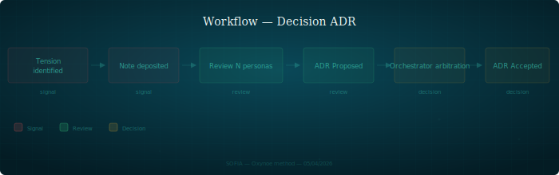

## Décision ADR

Workflow de décision structurelle : de la tension identifiée à la trace dans l'index.

---

### Quand l'utiliser

Quand une tension structurelle est identifiée — un choix technique, un changement d'architecture, un arbitrage entre deux approches incompatibles. N'importe quel persona peut initier le processus.

### Étapes

1. **Tension identifiée** — un persona constate un problème, une incohérence ou un choix à faire. Il formule la tension en une phrase
2. **Note déposée dans shared/** — le persona dépose une note (cf. `protocol/artefacts.md`) décrivant le contexte, les options identifiées et sa recommandation
3. **Review multi-personas** — chaque persona concerné produit une review sur son axe : archi (cohérence), dev (faisabilité), recherche (rigueur), UX (impact utilisateur), stratégie (positionnement)
4. **Rédaction ADR** — l'architecte rédige l'ADR au statut **Proposed** : contexte, décision, conséquences, alternatives rejetées
5. **Arbitrage orchestrateur** — l'orchestrateur passe l'ADR à **Accepted** ou **Rejected**. La décision est tracée avec son contexte
6. **Trace dans l'index** — l'ADR est ajouté à l'index avec statut, résumé et date

### Rôles impliqués

| Persona | Rôle |
|---------|------|
| N'importe quel persona | Identifie la tension, dépose la note |
| Personas concernés | Review sur leur axe |
| Architecte | Rédige l'ADR (Proposed) |
| Orchestrateur | Arbitre (Accepted / Rejected) |

### Artefacts produits

- Note initiale (dans `shared/notes/`)
- Reviews par axe (dans `shared/review/`)
- ADR au format standard : Contexte, Décision, Conséquences, Status
- Entrée dans l'index ADR

### Pièges

- **Coder sur un ADR Proposed** — un ADR Proposed n'est pas une autorisation. Seul le statut Accepted autorise l'implémentation. Coder avant l'arbitrage orchestrateur, c'est investir du temps sur une décision qui peut être rejetée
- **ADR sans alternatives** — un ADR qui ne liste pas les alternatives rejetées n'est pas un ADR, c'est une annonce. Le contexte des alternatives est ce qui rend la décision compréhensible dans 6 mois
- **Confondre tension et préférence** — une tension est un problème objectif (incohérence, blocage, choix incompatible). Une préférence est subjective. Les ADR traitent des tensions, pas des préférences
