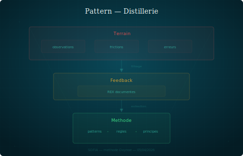

## Distillery

Field observations flow up into the method. Experience reports become documented patterns.

### Structure

The cycle has three phases:

1. **Observation**: a learning, a friction, or a REX is documented in `feedback/` or in a session summary. This is raw material, tied to a specific context.
2. **Extraction**: the orchestrator or a persona identifies what is universal in the observation — what would repeat in another context.
3. **Integration**: the extracted pattern is formalized and integrated into `core/` or `doc/`. It becomes a piece of the method, decoupled from its original context.

The distillery is what differentiates a collection of notes from a living method. Without this mechanism, learnings remain scattered and non-reusable.

### When to recognize it

- An observation in `feedback/` is cited multiple times in different contexts.
- A previously encountered problem reappears — a sign it wasn't capitalized.
- An intuitively made decision deserves to be made explicit as a principle.

### Example

The observation that personas should be defined by their production medium (documented in `feedback/persona-calibration.md`) was extracted and formalized as the pattern `media-calibration.md`. The original feedback remains in `feedback/` as a trace; the pattern lives in `canvas/patterns/`.

### Variants

- **Reverse distillery**: an existing pattern is invalidated by the field. The feedback documents the deviation, the pattern is amended or withdrawn.
- **Cross-distillery**: an observation from one domain (e.g. architecture) produces a pattern applicable in another (e.g. team method).

### Risks

- **Over-generalization**: transforming a one-off observation into a universal pattern too quickly.
- **Fossilization**: a documented pattern is never questioned even when the field evolves.
- **Accumulation without extraction**: feedbacks pile up but nobody distills them.
