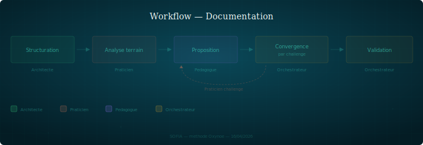

## Documentation

Documentation production workflow: from raw material to publishable doc.

---

### When to use it

For any method or product documentation that must be both structurally complete and pedagogically accessible. Applies when the subject is complex enough to require separation between structure, field, and pedagogy.

### Steps

1. **Structuring** — the architect produces a structural document from raw material (specs, ADR, code, sessions). Substance and exhaustiveness come first. No pedagogy concerns at this stage
2. **Field analysis** — the practitioner reads the document against the field (historical sessions, real usage, prescription/practice gaps). They note the gaps, the points where the doc doesn't match what actually happens
3. **Pedagogical proposal** — the pedagogue analyzes the structured document + field feedback and produces an approach proposal (reading path, progressive examples, target profile, reformulations)
4. **Convergence through challenge** — the orchestrator has the practitioner challenge the pedagogical proposal. Iterative loop until convergence: the field validates that pedagogy doesn't betray reality, the pedagogue adjusts
5. **Final validation** — the orchestrator verifies integrity (substance is not betrayed by form) and arbitrates remaining tensions

### Roles involved

| Persona | Role |
|---------|------|
| Architect | Produces the structural document (raw material → structure) |
| Practitioner | Analyzes against the field, notes gaps |
| Pedagogue | Proposes the pedagogical approach |
| Orchestrator | Drives convergence, arbitrates |

### Artifacts produced

- Structural document (in the architect's workspace)
- Field note (in `shared/notes/` — practitioner → pedagogue)
- Pedagogical proposal (in `shared/notes/` — pedagogue → orchestrator)
- Final document (in the product repo)

### Pitfalls

- **Pedagogizing too early** — if the structure is incomplete, pedagogy masks the gaps. The structural document must be exhaustive before the pedagogical pass
- **Field ignored** — a document that doesn't match real usage won't be applied. The practitioner is the safeguard
- **Pedagogy that betrays substance** — simplifying is not distorting. That's why the practitioner challenges the proposal, not the architect (who is too close to the material to judge readability)
- **Infinite loop** — convergence must be bounded. If after 2-3 iterations the practitioner and pedagogue don't converge, the orchestrator decides
