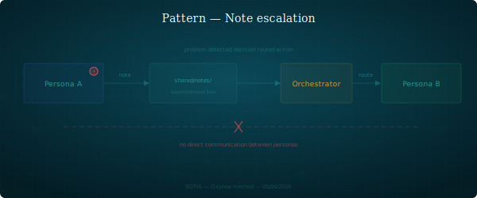

## Escalation by note

When a persona encounters a problem outside their scope, they deposit a note. The orchestrator routes.

### Structure

1. A persona identifies a problem that doesn't fall under their axis.
2. They write a factual note in `shared/notes/` with the format `note-{recipient}-{subject}-{author}.md`.
3. They don't attempt to resolve the problem themselves.
4. The orchestrator reads the note, adds the necessary context, and forwards it to the competent persona.
5. The recipient handles it and responds via the same mechanism if needed.

There is no direct inter-persona communication. The orchestrator is the sole router. This preserves context isolation and prevents unsupervised coordination loops.

### When to recognize it

- A persona hits a question outside their scope.
- Two personas would need to coordinate on a cross-cutting subject.
- A problem detected in one workspace concerns another workspace.

### Example

Axel identifies an inconsistency in the CVM spec during implementation. He deposits `note-mira-inconsistency-spec-cvm-axel.md` in `shared/notes/`. The orchestrator reads, confirms the context, and opens a session with Mira to address the point. Mira corrects the spec or justifies the existing choice.

### Variants

- **Informational note**: no problem to solve, just a signal (e.g. "I observed that..."). The orchestrator decides whether there's a follow-up.
- **Urgent note**: the persona signals a blocker in the title. The orchestrator prioritizes.

### Risks

- **Orchestrator congestion**: too many unprocessed notes accumulate. The orchestrator must sort regularly.
- **Over-formalism**: depositing a note for a trivial detail the persona could ignore.
- **Context loss**: the note is too short and the orchestrator can't route correctly.
