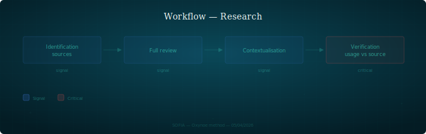

## Research

Research workflow: from source identification to usage verification.

---

### When to use it

Every time a document cites an external source — article, paper, documentation, specification. Also applies when a persona states a fact that requires a reference.

### Steps

1. **Source identification** — spot relevant sources for the subject. Favor primary sources (original paper, official spec) over secondary sources (blog posts, tutorials)
2. **Complete source reading** — read the source in full, not just the abstract or cited section. A partially read source is a misunderstood source
3. **Contextualization** — explicitly formulate why this source is relevant to this subject. What is the link between what the source says and what we want to show
4. **Usage context verification** — the critical question: does the source actually say what we make it say? Verify that the source's original context matches the usage we make of it

### Roles involved

| Persona | Role |
|---------|------|
| Research | Executes the workflow, produces verifications |
| Domain expert (architect, dev, strategy) | Provides usage context — why this source is cited |
| Orchestrator | Arbitrates in case of disagreement on relevance |

### Artifacts produced

- Source review (in `shared/review/`, format `review-sources-{subject}-{author}.md`)
- Contextualization notes if necessary
- Corrections in citing documents if a source is misused

### Pitfalls

- **Factual contamination** — a poorly contextualized reference propagates an error in all documents that cite it. This is the most costly error: it is invisible and multiplies
- **Citing without reading** — citing a source based on its title or abstract. The actual content may contradict the usage being made
- **Confusing authority and relevance** — a source can be reliable (recognized author, serious journal) without being relevant to the usage context. The review quality depends on the question asked, not just the source (cf. `protocol/exchange.md`)
