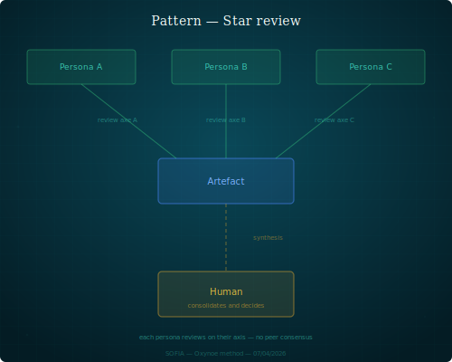

## Star Review

An artifact is submitted to N personas in parallel, each reviews it on their axis. The orchestrator consolidates.

### Structure

1. The orchestrator identifies an artifact that requires multi-angle validation.
2. They submit it simultaneously to N personas, each with a review instruction on their own axis.
3. Personas produce their reviews in parallel, without reading each other.
4. The orchestrator collects the reviews, identifies convergences and contradictions, and consolidates a decision.

The difference with the challenger pattern: the challenger fits into a sequential production flow (the producer integrates the feedback). The star review is a one-off validation mechanism — reviewers don't modify the artifact, the orchestrator decides.

### When to recognize it

- A structural document (ADR, spec, plan) must be validated before adoption.
- Multiple quality axes are at stake and no persona covers them all.
- Independent perspectives are wanted, not contaminated by others' opinions.

### Example

The orchestrator submits an ADR to Mira (consistency with target architecture), Léa (formal rigor, references), and Marc (strategic alignment). Each produces an independent review in `shared/review/`. The orchestrator reads all three, identifies a tension point between architectural consistency and strategy, and decides.

### Variants

- **Partial star**: only 2 of N axes are solicited, depending on the artifact's nature.
- **Iterative star**: after consolidation, the artifact is amended and resubmitted for a second round.

### Risks

- **Redundancy**: reviewers inadvertently cover the same ground — wasted time.
- **Paralysis**: reviews diverge and the orchestrator can't decide.
- **False parallel**: reviews are launched "in parallel" but are actually sequential (one persona reads another's review before producing their own).
