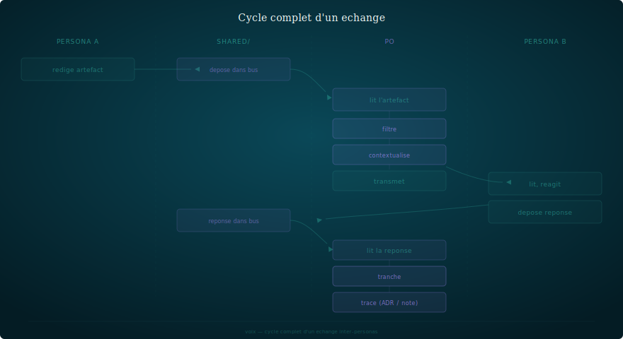

# Architecture — SOFIA

**Date** : 04/04/2026
**Auteur** : Mira — Architecte système & solution
**Statut** : Référence

---

## 1. Identité

| | |
|---|---|
| **Nom** | SOFIA |
| **Vocation** | Méthode d'orchestration d'assistants IA spécialisés |
| **Repo** | `oxynoe-dev/sofia` |
| **Licence** | MIT |
| **Public** | Développeurs et équipes utilisant Claude Code (ou LLM comparable) |
| **Principe fondateur** | La contrainte force la qualité — un LLM sans limites ne produit rien de bon |

### Positionnement

SOFIA n'est pas un framework, pas une librairie, pas un outil. C'est une **méthode** : un ensemble de principes, de conventions et de templates pour organiser des assistants IA spécialisés autour d'un projet.

Le seul prérequis est un LLM capable de suivre des instructions persistantes (CLAUDE.md, system prompts). Claude Code est l'implémentation de référence.

---


## 2. Architecture — Core / Protocol / Runtime + terrain

Trois couches indépendantes. On peut changer l'une sans toucher les autres.

### Core — les invariants de la méthode

Les principes fondamentaux. Ce qui ne change pas quand on change d'outil, de provider, ou de format d'échange. Si demain Claude Code disparaît, le core tient.

| Document | Couche | Concept clé | En une phrase |
|---|---|---|---|
| `principes.md` | Core | 7 principes | La contrainte force la qualité, l'humain arbitre, les fichiers sont le protocole |
| `personas.md` | Core | Anatomie d'un persona | Identité, posture, périmètre, livrables, interdits, collaboration |
| `friction.md` | Core | Friction intentionnelle | Les désaccords entre personas sont des signaux, pas des bugs |
| `devoirs.md` | Core | Devoirs de l'orchestrateur | 6 obligations que l'humain se donne pour que l'armature tienne |

**Règle de versionnage** : modifier un document core = minor bump.

| Templates | Contenu |
|---|---|
| **Structurels** | persona, claude-md, workspace, session, roadmap-produit, sofia-instance, team-orga |
| **Bus** | note, review, feature, adr |
| **Archétypes** | architecte, dev, ux, stratège, chercheur, rédacteur, graphiste |

Modifier un template = patch bump.

### Protocol — le contrat d'interface

Le protocol définit comment les personas échangent, tracent et s'organisent. Fichiers, pas API. Git, pas base de données. C'est ce qui rend SOFIA portable — n'importe quel outil capable de lire et écrire du markdown peut implémenter SOFIA.

| Document | Couche | Concept clé | En une phrase |
|---|---|---|---|
| `artefacts.md` | Protocol | Fichiers comme protocole | Bus d'échange structuré (notes, reviews, features) avec frontmatter |
| `conventions.md` | Protocol | Règles d'instance | Nommage, frontmatter, statuts, archivage |
| `tracabilite.md` | Protocol | Sessions + ADR + reviews | Si ce n'est pas tracé, ça n'existe pas |
| `isolation.md` | Protocol | Workspace = périmètre | Un persona ne voit que son espace — l'isolation force les échanges formels |
| `orchestration.md` | Protocol | PO comme message bus | Rien ne circule entre personas sans l'humain |
| `instance.md` | Protocol | Structure d'instance | Marqueur voix.md, workspaces, shared/, conventions |

### Runtime — l'implémentation concrète

4 documents spécifiques à Claude Code. C'est la seule couche qui change si on porte SOFIA sur un autre provider. Remplaçable sans toucher au core ni au protocol.

| Document | Rôle |
|---|---|
| `claude-md.md` | Anatomie du CLAUDE.md — le gardien du persona |
| `memoire.md` | Système de mémoire persistante entre conversations |
| `sessions.md` | Protocole ouverture/fermeture, résumé obligatoire |
| `hooks.md` | Automatisations déclenchées par des événements |

### doc/ — Documentation, terrain, décisions

| Contenu | Rôle |
|---|---|
| `examples/katen/` | 7 fiches personas — terrain de validation |
| `feedback/` | 9 REX — pièges, patterns, succès |
| `onboarding.md` | Guide de démarrage |
| `lexique.md` | Termes de la méthode |
| `utilisateur.md` | Guide utilisateur unifié |
| `arch-sofia.md` | Ce document |
| `figures/` | Visuels SVG |
| `adr/` | Décisions structurantes |
| `tests/` | Plans de test |

L'instance Katen (7 personas, 5 produits, 210+ sessions, 62 ADR) sert de vitrine et de validation.

---

## 3. Modèle conceptuel

### Le triangle SOFIA


Trois concepts interdépendants :
- **Persona** — un LLM contraint par un rôle, un périmètre et des interdits
- **Friction** — les désaccords qui émergent des contraintes entre personas
- **Artefact** — le fichier structuré qui matérialise l'échange et la trace

Le **PO** (humain) est au centre : il orchestre, filtre, contextualise, tranche.

### Cycle de vie d'un échange



Chaque flèche passe par le PO. Pas de raccourci.

### Instance SOFIA

Une **instance** est un projet qui applique la méthode. Elle contient :


Le fichier `voix.md` à la racine identifie le dépôt comme instance et lie à la méthode.

---

## 4. Principes d'architecture

### P1 — Le core tient sans outil

Les 7 principes et le modèle conceptuel sont indépendants de Claude Code. On pourrait appliquer SOFIA avec des fichiers texte et un éditeur. Le runtime est un accélérateur, pas un prérequis.

### P2 — Core / Protocol / Runtime

Trois couches indépendantes. On peut :
- Changer le runtime (Claude Code → autre provider) sans toucher au protocol ni au core
- Faire évoluer le protocol (nouveaux formats d'artefacts) sans changer les principes
- Lire le core sans connaître l'outil

### P3 — Le PO est l'unique point de passage

Aucun échange direct entre personas. L'humain filtre, reformule, contextualise, tranche. C'est le coût de la qualité.

### P4 — L'isolation crée le besoin d'artefacts

Un persona qui ne voit pas le code est obligé de spécifier. Un persona qui ne décide pas de l'architecture est obligé de remonter les frictions. L'isolation n'est pas une limitation — c'est le mécanisme générateur.

### P5 — Les fichiers sont la source de vérité

Pas les conversations, pas la mémoire, pas les sessions compressées. Les fichiers versionnés dans git.

### P6 — Gradient d'activation

| Seuil | Ce qui s'active |
|---|---|
| **1 persona** | CLAUDE.md + sessions/ — la base |
| **2+ personas** | shared/ (notes, reviews) — le bus d'échange |
| **3+ personas** | backlog.md par workspace — l'état local |
| **4+ personas** | shared/features/ — les specs ne passent plus par notes |
| **5+ personas, 2+ produits** | Convergence (produit compagnon) — dashboard, inbox, journal |

On commence petit, on ajoute de la structure quand la charge mentale du PO l'exige.

---

## 5. Structure du repo


---

## 6. Relation avec les produits compagnons

### Convergence

| | SOFIA | Convergence |
|---|---|---|
| **Répond à** | Comment organiser mes assistants IA | Comment piloter quand ça scale |
| **Quand** | Dès le premier persona | À partir de 5+ personas et 2+ produits |
| **Publié** | Méthode, implémentation, outillage | build.py, dashboard, specs de format |
| **Formats** | Fournit les templates (backlog, roadmap, note...) | Parse ces mêmes formats |

SOFIA définit les conventions. Convergence les consomme. Pas de duplication — renvois croisés.

### Produits Oxynoe

| Produit | Lien avec SOFIA |
|---|---|
| **Katen** | Instance de référence (7 personas, terrain de validation) |
| **Convergence** | Compagnon de pilotage (consomme les artefacts SOFIA) |
| **Fragments** | Futur — produit éditorial, instance distincte |
| **Regards** | Futur — veille augmentée, instance distincte |

---

## 7. Portabilite multi-provider

### Architecture actuelle

`core/` et `protocol/` sont provider-agnostic (voir structure du repo en section 5). `runtime/` est le seul point de variation. Ajouter un provider = ajouter `runtime/mistral/`, `runtime/gemini/`, etc. Chaque adaptateur documente les équivalents du provider pour : instructions persistantes, mémoire, sessions, automatisations.

### Multi-provider (v0.5)

```
runtime/
├── claude-code/       ← actuel
├── mistral/           ← futur
└── gemini/            ← futur
```

Pré-requis : retours utilisateurs v0.3 + i18n v0.4. Ne pas anticiper sans feedback.

---

## 8. Décisions

| Décision | Raison |
|---|---|
| Méthode provider-agnostic, implémentation spécifique | Portabilité future sans sacrifier la profondeur Claude Code |
| Le PO ne délègue pas l'arbitrage | C'est la règle non négociable — sans arbitre, la friction est du chaos |
| Fichiers comme protocole (pas de chat) | La lenteur force la clarté, les fichiers persistent et sont versionnables |
| Gradient d'activation | La méthode ne se déploie pas en big bang — elle grandit avec le projet |
| Convergence = produit séparé | Deux publics différents, deux timelines de publication |
| Templates + archétypes | Réduire la friction d'adoption sans imposer un modèle rigide |

---

*Mira — 04/04/2026*
