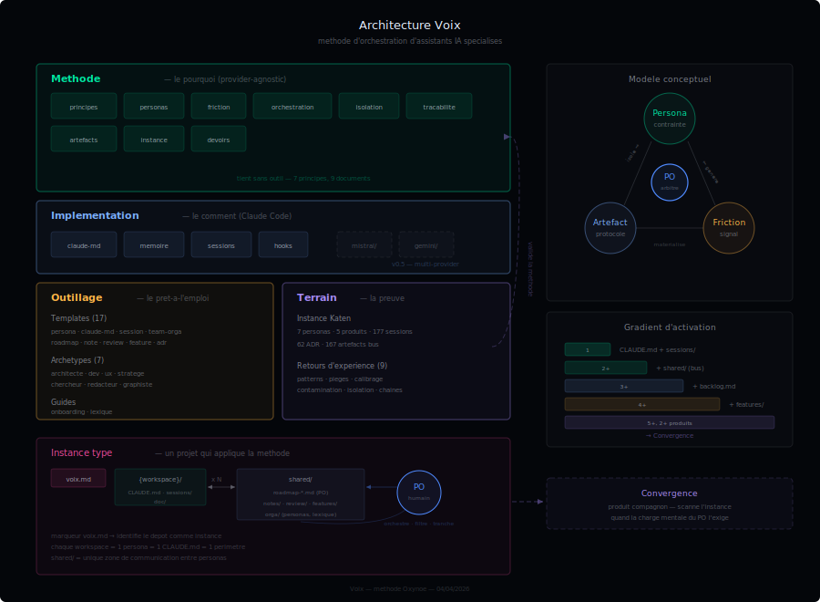

# Architecture — Voix

**Date** : 30/03/2026
**Auteur** : Mira — Architecte systeme & solution
**Statut** : Reference

---

## 1. Identite

| | |
|---|---|
| **Nom** | Voix |
| **Vocation** | Methode d'orchestration d'assistants IA specialises |
| **Repo** | `oxynoe-dev/voix` |
| **Licence** | MIT |
| **Public** | Developpeurs et equipes utilisant Claude Code (ou LLM comparable) |
| **Principe fondateur** | La contrainte force la qualite — un LLM sans limites ne produit rien de bon |

### Positionnement

Voix n'est pas un framework, pas une librairie, pas un outil. C'est une **methode** : un ensemble de principes, de conventions et de templates pour organiser des assistants IA specialises autour d'un projet.

Le seul prerequis est un LLM capable de suivre des instructions persistantes (CLAUDE.md, system prompts). Claude Code est l'implementation de reference.

---



## 2. Architecture — 3 couches + terrain

```
┌─────────────────────────────────────────────────────────┐
│                      METHODE                             │
│  principes · personas · friction · orchestration ·       │
│  isolation · tracabilite · artefacts                     │
│  → Le pourquoi. Tient sans outil.                        │
├─────────────────────────────────────────────────────────┤
│                   IMPLEMENTATION                         │
│  claude-md · memoire · sessions · hooks                  │
│  → Le comment. Specifique Claude Code aujourd'hui.       │
├─────────────────────────────────────────────────────────┤
│                      OUTILLAGE                           │
│  templates (14) · archetypes (7) · onboarding · lexique  │
│  → Le pret-a-l'emploi.                                   │
└─────────────────────────────────────────────────────────┘
        ↓ alimente par ↓
┌─────────────────────────────────────────────────────────┐
│                      TERRAIN                             │
│  exemples/katen (7 personas) · retours (3 REX)           │
│  → La preuve. Le terrain valide la methode.              │
└─────────────────────────────────────────────────────────┘
```

### Couche Methode (provider-agnostic)

7 documents fondateurs. Aucune dependance a un outil specifique.

| Document | Concept cle | En une phrase |
|---|---|---|
| `principes.md` | 7 principes | La contrainte force la qualite, l'humain arbitre, les fichiers sont le protocole |
| `personas.md` | Anatomie d'un persona | Identite, posture, perimetre, livrables, interdits, collaboration |
| `friction.md` | Friction intentionnelle | Les desaccords entre personas sont des signaux, pas des bugs |
| `orchestration.md` | PO comme message bus | Rien ne circule entre personas sans l'humain |
| `isolation.md` | Workspace = perimetre | Un persona ne voit que son espace — l'isolation force les echanges formels |
| `tracabilite.md` | Sessions + ADR + reviews | Si ce n'est pas trace, ca n'existe pas |
| `artefacts.md` | Fichiers comme protocole | Bus d'echange structure (notes, reviews, features) avec frontmatter |

### Couche Implementation (Claude Code)

4 documents specifiques a Claude Code. C'est la couche qui change si on porte Voix sur un autre provider.

| Document | Role |
|---|---|
| `claude-md.md` | Anatomie du CLAUDE.md — le gardien du persona |
| `memoire.md` | Systeme de memoire persistante entre conversations |
| `sessions.md` | Protocole ouverture/fermeture, resume obligatoire |
| `hooks.md` | Automatisations declenchees par des evenements |

### Couche Outillage

Templates et outils prets a l'emploi pour bootstrapper une instance.

| Categorie | Contenu |
|---|---|
| **Templates structurels** | persona, claude-md, workspace, session, backlog, roadmap-produit, voix-instance |
| **Templates bus** | note, review, feature, adr |
| **Archetypes personas** | architecte, dev, ux, stratege, chercheur, redacteur, graphiste |
| **Guides** | onboarding (process d'accueil), lexique (template) |

### Terrain

L'instance Katen (7 personas, 5 produits) sert de vitrine et de validation. Les retours d'experience documentent les pieges et les succes.

---

## 3. Modele conceptuel

### Le triangle Voix

```
        Persona
       (contrainte)
        /       \
       /  PO     \
      / (arbitre)  \
     /               \
  Artefact ────── Friction
 (protocole)      (signal)
```

Trois concepts interdependants :
- **Persona** — un LLM contraint par un role, un perimetre et des interdits
- **Friction** — les desaccords qui emergent des contraintes entre personas
- **Artefact** — le fichier structure qui materialise l'echange et la trace

Le **PO** (humain) est au centre : il orchestre, filtre, contextualise, tranche.

### Cycle de vie d'un echange

```
Persona A          shared/              PO              Persona B
─────────          ───────              ──              ─────────
redige artefact →  depose dans bus
                                    ← lit l'artefact
                                       filtre
                                       contextualise
                                       transmet →
                                                        lit, reagit
                                                     ← depose reponse
                                    ← lit la reponse
                                       tranche
                                       trace (ADR/note)
```

Chaque fleche passe par le PO. Pas de raccourci.

### Instance Voix

Une **instance** est un projet qui applique la methode. Elle contient :

```
instance/
├── voix.md                   ← marqueur d'instance
├── {workspace}/              ← 1 par persona (CLAUDE.md, sessions/, backlog.md)
├── shared/                   ← bus d'echange
│   ├── roadmap-*.md            roadmaps produit (PO)
│   ├── notes/                  messages inter-personas
│   ├── review/                 analyses critiques
│   ├── features/               specs fonctionnalites
│   └── orga/                   personas, figures, lexique
└── conventions.md            ← regles de l'instance
```

Le fichier `voix.md` a la racine identifie le depot comme instance et lie a la methode.

---

## 4. Principes d'architecture

### P1 — La methode tient sans outil

Les 7 principes et le modele conceptuel sont independants de Claude Code. On pourrait appliquer Voix avec des fichiers texte et un editeur. L'implementation Claude Code est un accelerateur, pas un prerequis.

### P2 — Separation methode / implementation / outillage

Trois couches independantes. On peut :
- Lire la methode sans toucher aux templates
- Utiliser les templates sans comprendre les hooks Claude Code
- Porter l'implementation sur un autre provider sans changer la methode

### P3 — Le PO est l'unique point de passage

Aucun echange direct entre personas. L'humain filtre, reformule, contextualise, tranche. C'est le cout de la qualite.

### P4 — L'isolation cree le besoin d'artefacts

Un persona qui ne voit pas le code est oblige de specifier. Un persona qui ne decide pas de l'architecture est oblige de remonter les frictions. L'isolation n'est pas une limitation — c'est le mecanisme generateur.

### P5 — Les fichiers sont la source de verite

Pas les conversations, pas la memoire, pas les sessions compressees. Les fichiers versionnes dans git.

### P6 — Gradient d'activation

| Seuil | Ce qui s'active |
|---|---|
| **1 persona** | CLAUDE.md + sessions/ — la base |
| **2+ personas** | shared/ (notes, reviews) — le bus d'echange |
| **3+ personas** | backlog.md par workspace — l'etat local |
| **4+ personas** | shared/features/ — les specs ne passent plus par notes |
| **5+ personas, 2+ produits** | Convergence (produit compagnon) — dashboard, inbox, journal |

On commence petit, on ajoute de la structure quand la charge mentale du PO l'exige.

---

## 5. Structure du repo

```
voix/
├── CLAUDE.md                        ← guide interactif d'onboarding
├── README.md                        ← manifeste
├── LICENSE                          ← MIT
│
├── methode/                         ← couche 1 : le pourquoi (7 docs)
│   ├── principes.md
│   ├── personas.md
│   ├── friction.md
│   ├── orchestration.md
│   ├── isolation.md
│   ├── tracabilite.md
│   ├── artefacts.md
│   └── instance.md
│
├── claude-code/                     ← couche 2 : le comment (4 docs)
│   ├── claude-md.md
│   ├── memoire.md
│   ├── sessions.md
│   └── hooks.md
│
├── outillage/                       ← couche 3 : le pret-a-l'emploi
│   ├── onboarding.md
│   ├── lexique.md
│   └── templates/
│       ├── persona.md                 template vierge
│       ├── persona-{archetype}.md     7 archetypes pre-remplis
│       ├── claude-md.md
│       ├── session.md
│       ├── backlog.md
│       ├── roadmap-produit.md
│       ├── voix-instance.md
│       ├── note.md
│       ├── review.md
│       ├── feature.md
│       ├── adr.md
│       └── workspace/
│           └── CLAUDE.md
│
├── exemples/katen/                  ← terrain : 7 fiches
│   ├── mira.md · axel.md · lea.md
│   ├── nora.md · marc.md
│   └── sofia.md · winston.md
│
├── retours/                         ← terrain : REX
│   ├── katen.md
│   ├── pieges.md
│   └── cas-adr-051.md
│
└── doc/                             ← architecture et decisions
    ├── arch-voix.md                   ce document
    ├── arch-voix.svg                  vue architecture
    ├── adr/                           decisions structurantes
    └── tests/                         plans de test
```

---

## 6. Relation avec les produits compagnons

### Convergence

| | Voix | Convergence |
|---|---|---|
| **Repond a** | Comment organiser mes assistants IA | Comment piloter quand ca scale |
| **Quand** | Des le premier persona | A partir de 5+ voix et 2+ produits |
| **Publie** | Methode, implementation, outillage | build.py, dashboard, specs de format |
| **Formats** | Fournit les templates (backlog, roadmap, note...) | Parse ces memes formats |

Voix definit les conventions. Convergence les consomme. Pas de duplication — renvois croises.

### Produits Oxynoe

| Produit | Lien avec Voix |
|---|---|
| **Katen** | Instance de reference (7 personas, terrain de validation) |
| **Convergence** | Compagnon de pilotage (consomme les artefacts Voix) |
| **Fragments** | Futur — produit editorial, instance distincte |
| **Regards** | Futur — veille augmentee, instance distincte |

---

## 7. Portabilite multi-provider

### Architecture cible (v0.5)

```
voix/
├── methode/          ← noyau commun (provider-agnostic)
├── outillage/        ← noyau commun
├── claude-code/      ← adaptateur Claude Code
├── mistral/          ← adaptateur Mistral (futur)
├── gemini/           ← adaptateur Gemini (futur)
└── ...
```

La couche methode et outillage sont deja provider-agnostic. La couche implementation (claude-code/) est le seul point de variation. Chaque adaptateur documente les equivalents du provider pour : instructions persistantes, memoire, sessions, automatisations.

Pre-requis : retours utilisateurs v0.3 + i18n v0.4. Ne pas anticiper sans feedback.

---

## 8. Decisions

| Decision | Raison |
|---|---|
| Methode provider-agnostic, implementation specifique | Portabilite future sans sacrifier la profondeur Claude Code |
| Le PO ne delegue pas l'arbitrage | C'est la regle non negociable — sans arbitre, la friction est du chaos |
| Fichiers comme protocole (pas de chat) | La lenteur force la clarte, les fichiers persistent et sont versionnables |
| Gradient d'activation | La methode ne se deploie pas en big bang — elle grandit avec le projet |
| Convergence = produit separe | Deux publics differents, deux timelines de publication |
| Templates + archetypes | Reduire la friction d'adoption sans imposer un modele rigide |

---

*Mira — 30/03/2026*
