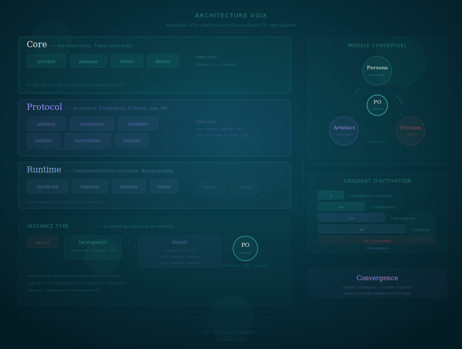
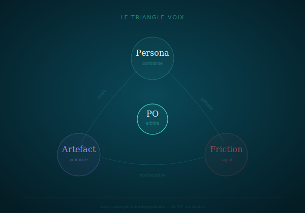

# Architecture — Voix

**Date** : 04/04/2026
**Auteur** : Mira — Architecte systeme & solution
**Statut** : Reference

---

## 1. Identite

| | |
|---|---|
| **Nom** | Voix |
| **Vocation** | Methode d'orchestration d'assistants IA specialises |
| **Repo** | `oxynoe-dev/voix` |
| **Licence** | MIT |
| **Public** | Developpeurs et equipes utilisant Claude Code (ou LLM comparable) |
| **Principe fondateur** | La contrainte force la qualite — un LLM sans limites ne produit rien de bon |

### Positionnement

Voix n'est pas un framework, pas une librairie, pas un outil. C'est une **methode** : un ensemble de principes, de conventions et de templates pour organiser des assistants IA specialises autour d'un projet.

Le seul prerequis est un LLM capable de suivre des instructions persistantes (CLAUDE.md, system prompts). Claude Code est l'implementation de reference.

---



## 2. Architecture — Core / Protocol / Runtime + terrain

Trois couches independantes. On peut changer l'une sans toucher les autres.

### Core — les invariants de la methode

Les principes fondamentaux. Ce qui ne change pas quand on change d'outil, de provider, ou de format d'echange. Si demain Claude Code disparait, le core tient.

| Document | Couche | Concept cle | En une phrase |
|---|---|---|---|
| `principes.md` | Core | 7 principes | La contrainte force la qualite, l'humain arbitre, les fichiers sont le protocole |
| `personas.md` | Core | Anatomie d'un persona | Identite, posture, perimetre, livrables, interdits, collaboration |
| `friction.md` | Core | Friction intentionnelle | Les desaccords entre personas sont des signaux, pas des bugs |
| `devoirs.md` | Core | Devoirs de l'orchestrateur | 6 obligations que l'humain se donne pour que l'armature tienne |

**Regle de versionnage** : modifier un document core = minor bump.

| Templates | Contenu |
|---|---|
| **Structurels** | persona, claude-md, workspace, session, roadmap-produit, voix-instance, team-orga |
| **Bus** | note, review, feature, adr |
| **Archetypes** | architecte, dev, ux, stratege, chercheur, redacteur, graphiste |

Modifier un template = patch bump.

### Protocol — le contrat d'interface

Le protocol definit comment les personas echangent, tracent et s'organisent. Fichiers, pas API. Git, pas base de donnees. C'est ce qui rend Voix portable — n'importe quel outil capable de lire et ecrire du markdown peut implementer Voix.

| Document | Couche | Concept cle | En une phrase |
|---|---|---|---|
| `artefacts.md` | Protocol | Fichiers comme protocole | Bus d'echange structure (notes, reviews, features) avec frontmatter |
| `conventions.md` | Protocol | Regles d'instance | Nommage, frontmatter, statuts, archivage |
| `tracabilite.md` | Protocol | Sessions + ADR + reviews | Si ce n'est pas trace, ca n'existe pas |
| `isolation.md` | Protocol | Workspace = perimetre | Un persona ne voit que son espace — l'isolation force les echanges formels |
| `orchestration.md` | Protocol | PO comme message bus | Rien ne circule entre personas sans l'humain |
| `instance.md` | Protocol | Structure d'instance | Marqueur voix.md, workspaces, shared/, conventions |

### Runtime — l'implementation concrete

4 documents specifiques a Claude Code. C'est la seule couche qui change si on porte Voix sur un autre provider. Remplacable sans toucher au core ni au protocol.

| Document | Role |
|---|---|
| `claude-md.md` | Anatomie du CLAUDE.md — le gardien du persona |
| `memoire.md` | Systeme de memoire persistante entre conversations |
| `sessions.md` | Protocole ouverture/fermeture, resume obligatoire |
| `hooks.md` | Automatisations declenchees par des evenements |

### doc/ — Documentation, terrain, decisions

| Contenu | Role |
|---|---|
| `examples/katen/` | 7 fiches personas — terrain de validation |
| `feedback/` | 9 REX — pieges, patterns, succes |
| `onboarding.md` | Guide de demarrage |
| `lexique.md` | Termes de la methode |
| `utilisateur.md` | Guide utilisateur unifie |
| `arch-voix.md` | Ce document |
| `figures/` | Visuels SVG |
| `adr/` | Decisions structurantes |
| `tests/` | Plans de test |

L'instance Katen (7 personas, 5 produits, 210+ sessions, 62 ADR) sert de vitrine et de validation.

---

## 3. Modele conceptuel

### Le triangle Voix



Trois concepts interdependants :
- **Persona** — un LLM contraint par un role, un perimetre et des interdits
- **Friction** — les desaccords qui emergent des contraintes entre personas
- **Artefact** — le fichier structure qui materialise l'echange et la trace

Le **PO** (humain) est au centre : il orchestre, filtre, contextualise, tranche.

### Cycle de vie d'un echange


Chaque fleche passe par le PO. Pas de raccourci.

### Instance Voix

Une **instance** est un projet qui applique la methode. Elle contient :


Le fichier `voix.md` a la racine identifie le depot comme instance et lie a la methode.

---

## 4. Principes d'architecture

### P1 — Le core tient sans outil

Les 7 principes et le modele conceptuel sont independants de Claude Code. On pourrait appliquer Voix avec des fichiers texte et un editeur. Le runtime est un accelerateur, pas un prerequis.

### P2 — Core / Protocol / Runtime

Trois couches independantes. On peut :
- Changer le runtime (Claude Code → autre provider) sans toucher au protocol ni au core
- Faire evoluer le protocol (nouveaux formats d'artefacts) sans changer les principes
- Lire le core sans connaitre l'outil

### P3 — Le PO est l'unique point de passage

Aucun echange direct entre personas. L'humain filtre, reformule, contextualise, tranche. C'est le cout de la qualite.

### P4 — L'isolation cree le besoin d'artefacts

Un persona qui ne voit pas le code est oblige de specifier. Un persona qui ne decide pas de l'architecture est oblige de remonter les frictions. L'isolation n'est pas une limitation — c'est le mecanisme generateur.

### P5 — Les fichiers sont la source de verite

Pas les conversations, pas la memoire, pas les sessions compressees. Les fichiers versionnes dans git.

### P6 — Gradient d'activation

| Seuil | Ce qui s'active |
|---|---|
| **1 persona** | CLAUDE.md + sessions/ — la base |
| **2+ personas** | shared/ (notes, reviews) — le bus d'echange |
| **3+ personas** | backlog.md par workspace — l'etat local |
| **4+ personas** | shared/features/ — les specs ne passent plus par notes |
| **5+ personas, 2+ produits** | Convergence (produit compagnon) — dashboard, inbox, journal |

On commence petit, on ajoute de la structure quand la charge mentale du PO l'exige.

---

## 5. Structure du repo


---

## 6. Relation avec les produits compagnons

### Convergence

| | Voix | Convergence |
|---|---|---|
| **Repond a** | Comment organiser mes assistants IA | Comment piloter quand ca scale |
| **Quand** | Des le premier persona | A partir de 5+ voix et 2+ produits |
| **Publie** | Methode, implementation, outillage | build.py, dashboard, specs de format |
| **Formats** | Fournit les templates (backlog, roadmap, note...) | Parse ces memes formats |

Voix definit les conventions. Convergence les consomme. Pas de duplication — renvois croises.

### Produits Oxynoe

| Produit | Lien avec Voix |
|---|---|
| **Katen** | Instance de reference (7 personas, terrain de validation) |
| **Convergence** | Compagnon de pilotage (consomme les artefacts Voix) |
| **Fragments** | Futur — produit editorial, instance distincte |
| **Regards** | Futur — veille augmentee, instance distincte |

---

## 7. Portabilite multi-provider

### Architecture actuelle

`core/` et `protocol/` sont provider-agnostic (voir structure du repo en section 5). `runtime/` est le seul point de variation. Ajouter un provider = ajouter `runtime/mistral/`, `runtime/gemini/`, etc. Chaque adaptateur documente les equivalents du provider pour : instructions persistantes, memoire, sessions, automatisations.

### Multi-provider (v0.5)

```
runtime/
├── claude-code/       ← actuel
├── mistral/           ← futur
└── gemini/            ← futur
```

Pre-requis : retours utilisateurs v0.3 + i18n v0.4. Ne pas anticiper sans feedback.

---

## 8. Decisions

| Decision | Raison |
|---|---|
| Methode provider-agnostic, implementation specifique | Portabilite future sans sacrifier la profondeur Claude Code |
| Le PO ne delegue pas l'arbitrage | C'est la regle non negociable — sans arbitre, la friction est du chaos |
| Fichiers comme protocole (pas de chat) | La lenteur force la clarte, les fichiers persistent et sont versionnables |
| Gradient d'activation | La methode ne se deploie pas en big bang — elle grandit avec le projet |
| Convergence = produit separe | Deux publics differents, deux timelines de publication |
| Templates + archetypes | Reduire la friction d'adoption sans imposer un modele rigide |

---

*Mira — 04/04/2026*
