# Dashboard guide

> How to read the SOFIA dashboard — the 5 views, what each shows, and what to look for.
> This guide covers the dashboard UI. For how to generate data and run the server, see [analysis-guide.md](analysis-guide.md). For conformity checks, see [audit-guide.md](audit-guide.md).
> The dashboard is specific to the **filesystem binding** (`binding/filesystem/`). It instruments real session logs and artifacts — nothing is simulated.

---

## The 5 views

| View | Question | Content |
|------|----------|---------|
| **Map** | What does the organization look like? | Instance topology, persona cards, trajectory |
| **Mirror** | Am I healthy as an orchestrator? | KPIs, radars, trajectory, contribution flow |
| **Lens** | What happened over time? | Time series, per-persona breakdown, distributions |
| **Probe** | Is the instance structurally conforming? | Pass/warn/fail checks, signals |
| **Legend** | How do I read all this? | In-dashboard documentation of every metric |

---

## Map

Entry point. Shows the functional topology of your SOFIA setup.

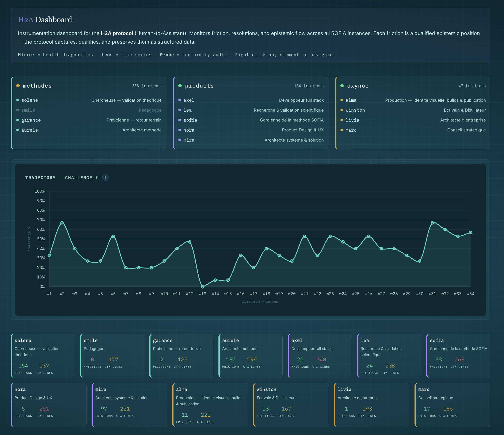

### Instance cards

One card per instance (top row):
- **Health dot** (green/orange/red) — percentage of personas with friction data
- **Persona list** — each persona with their role. Greyed-out = no friction (blind spot)
- **Friction count** — total frictions detected (top right of each card)

Right-click any instance or persona to navigate directly to Mirror, Lens, or Probe with the filter pre-selected.

### Trajectory

Challenge % over time using friction windows (not calendar). A descending line = the instance is going quiet. Hover for date range per window.

### Persona mini cards

Bottom row: one small card per persona showing friction count and context size (lines loaded at boot). Color-coded: green = healthy, yellow = attention, red = danger.

---

## Mirror

The orchestrator sees their own practice reflected back.

### KPI banner

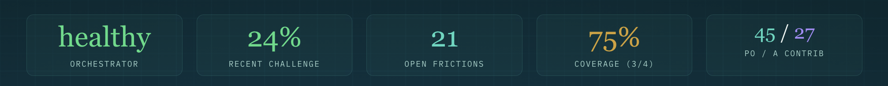

Five indicators at the top:

| KPI | What it measures | Healthy | Warning |
|-----|------------------|---------|---------|
| **Orchestrator** | Is the orchestrator still pushing back AND resolving? | "healthy" (green) | "complacent" (red) — H→A = 0 AND >10 open frictions |
| **Recent challenge** | Challenge % of last N frictions (non-sound share) | Stable above 20-30% | Dropping toward 0% |
| **Open frictions** | Frictions without resolution — piloting debt | Low count, decreasing | Growing backlog |
| **Coverage** | % of personas with at least one friction | 100% (green) | ≤50% (red) — half the team is invisible. Shows count (e.g. 3/4) |
| **PO / A contrib** | Epistemic contributions — orchestrator vs assistants | Balanced | Heavy imbalance either way |

### Instance radar

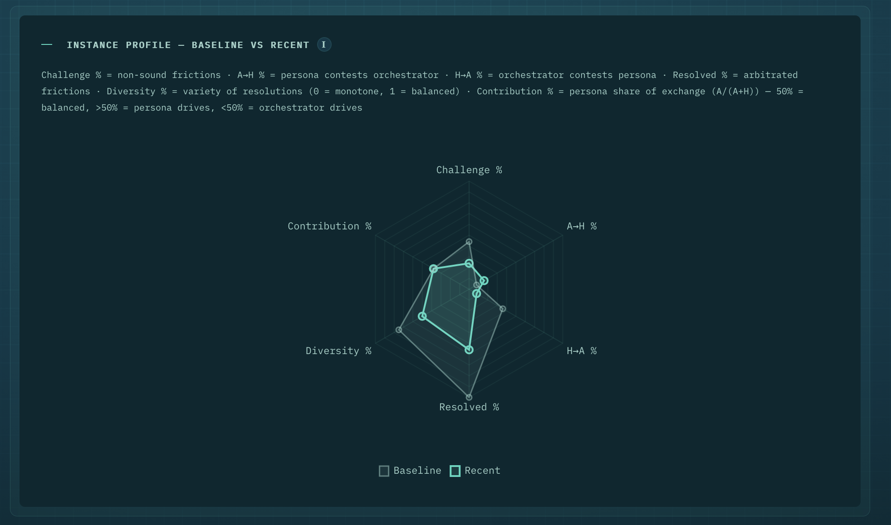

6 axes. Two contours: grey (baseline — first N frictions) and colored (recent — last N frictions). If the colored contour shrinks, the practice is degrading.

| Axis | Formula | Meaning |
|------|---------|---------|
| **Challenge %** | (contestable + simplification + blind_spot) / total | How much friction is actual pushback vs validation |
| **A→H %** | AI contests human / total | Persona pushes back on the orchestrator |
| **H→A %** | Human contests AI / total | Orchestrator pushes back on persona |
| **Resolved %** | resolved / total | Frictions with explicit decisions |
| **Diversity %** | distinct resolution types / 4 | Variety of decisions (25% = only ratified, 100% = all four) |
| **Contribution %** | A / (A + H) | Persona's share of the epistemic exchange |

### Persona radars

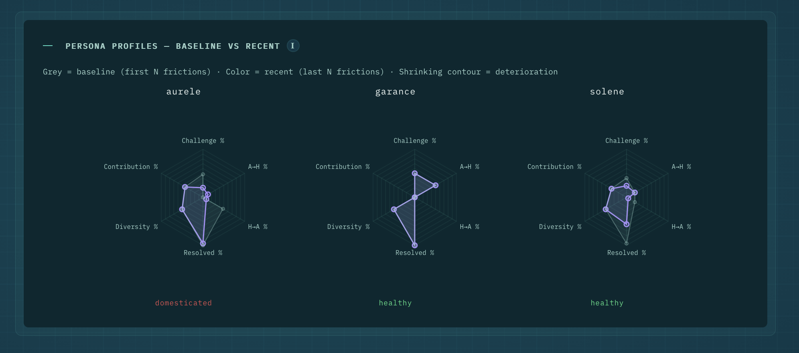

One radar per persona, displayed side by side. Same 6 axes as the instance radar. Each persona gets a **diagnostic** label below: "healthy" (green), "domesticated" (red), "improving" (blue). A persona marked "domesticated" has a shrinking recent contour — its friction output is converging toward pure validation.

### Trajectory

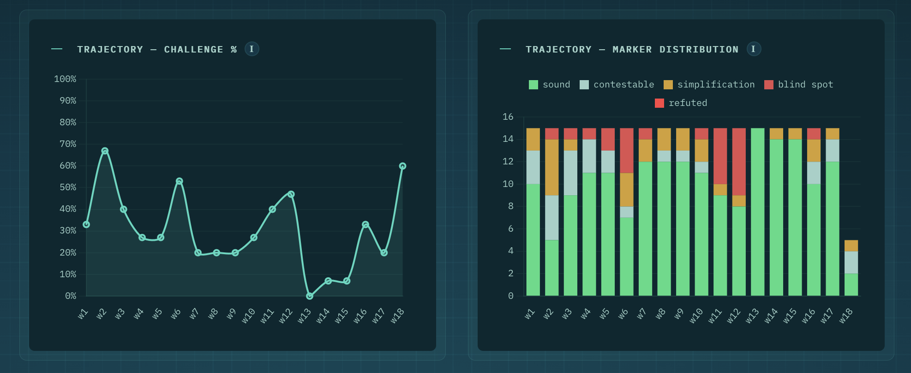

Two side-by-side views:
- **Left — Challenge %**: line chart by friction window (w1, w2...). A descending line = the instance is going quiet.
- **Right — Marker distribution**: stacked bar per window showing the breakdown (sound, contestable, simplification, blind_spot, refuted). Shows *what kind* of friction happens in each window.

Windows are not calendar-based — a window may cover 2 days or 2 weeks depending on friction density.

### Contribution flow

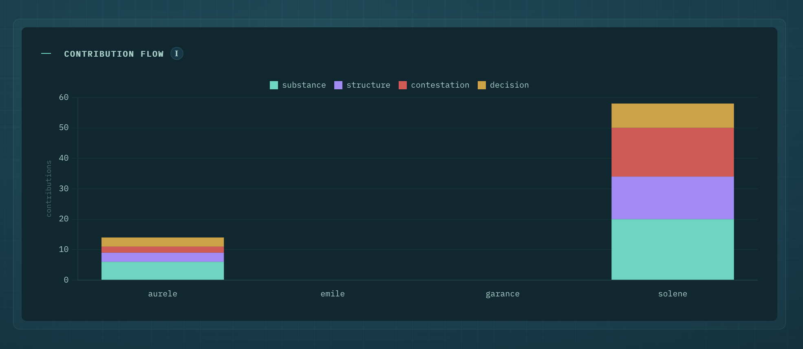

Stacked bar per persona showing the epistemic contribution breakdown:

| Type | Color | Meaning |
|------|-------|---------|
| **substance** | teal | New information — facts, data, references |
| **structure** | purple | Organization, categorization, synthesis |
| **contestation** | red | Challenge, counter-example, reframing |
| **decision** | gold | Arbitration, choice made |

A persona with mostly substance = content provider. A persona with mostly contestation = challenger. The orchestrator typically brings decision.

### Delta table

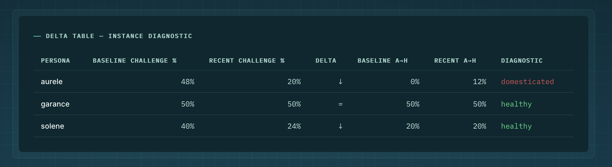

Per-persona trend indicators:
- **Baseline challenge %** vs **Recent challenge %** — with delta arrow (↓ = degrading, = = stable, ↑ = improving)
- **Baseline A→H** vs **Recent A→H** — how much the persona pushes back
- **Diagnostic** — "healthy" (green), "domesticated" (red), derived from the delta

### Open frictions

Last 20 unresolved frictions — the orchestrator's arbitration backlog.

---

## Lens

Raw data exploration. Time series, counts, distributions.

### KPI banner

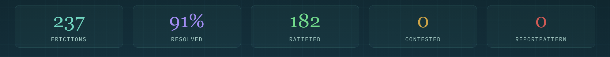

Five counters: total frictions, resolved %, ratified, contested, reportPattern triggers.

### Filters

- **Instance** — select one or all
- **Persona** — select one or all
- **Period** — last 7 days, 30 days, or all
- **Granularity** — day or week

### Friction by marker — timeline

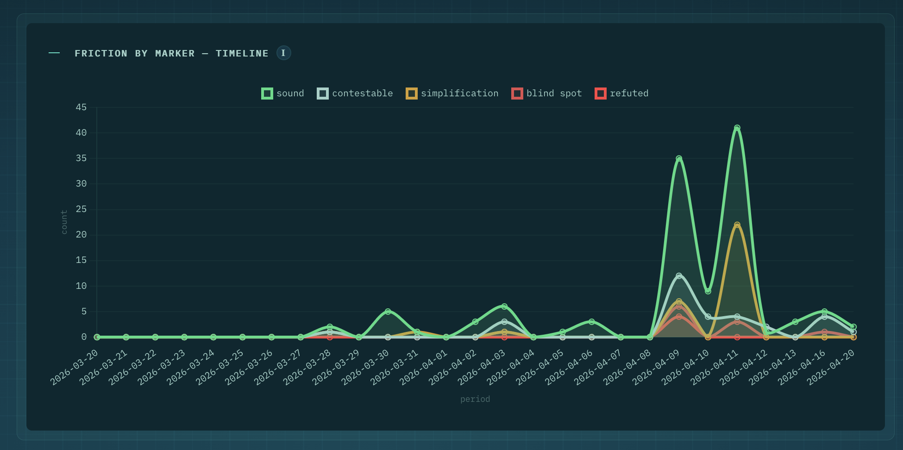

5 lines over time (one per marker: sound, contestable, simplification, blind_spot, refuted). X axis = dates, Y axis = count. Shows the rhythm and nature of friction production. Spikes indicate intense sessions.

### Markers and resolutions by persona

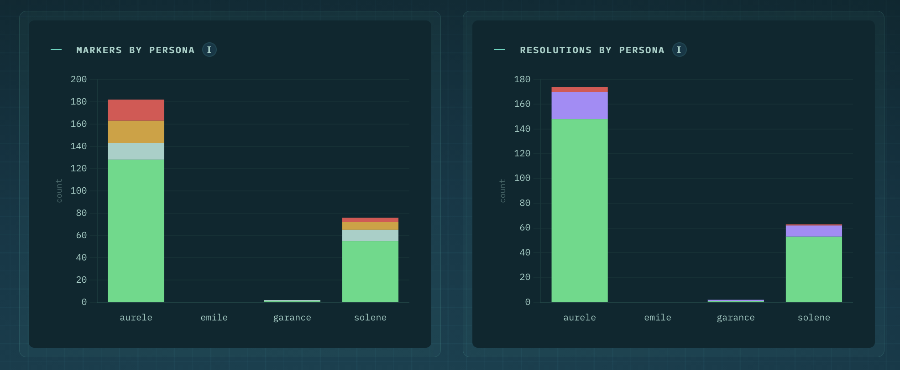

Two stacked bars side by side:
- **Left — Markers by persona**: breakdown of marker types per persona. Shows who produces what kind of friction.
- **Right — Resolutions by persona**: breakdown of resolution types (ratified, contested, revised, rejected). Shows how friction is resolved per persona.

### Directional matrix

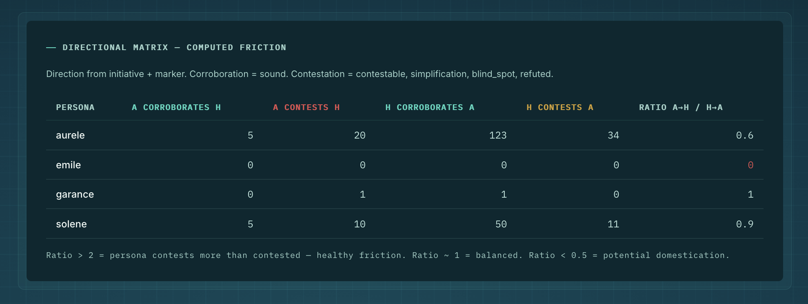

Table showing the 4 directions per persona:
- **A corroborates H** — persona validates the orchestrator (sound)
- **A contests H** — persona pushes back on the orchestrator
- **H corroborates A** — orchestrator validates the persona
- **H contests A** — orchestrator pushes back on the persona
- **Ratio A→H / H→A** — > 2 = healthy friction (persona contests more than contested). < 0.5 = potential domestication.

### Detail by persona

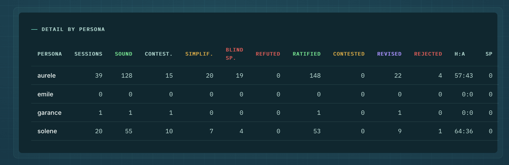

Complete table: sessions, all 5 markers, all 4 resolutions, H:A epistemic flux ratio, signaler pattern count. The single-screen overview of every persona's activity.

---

## Probe

Structural conformity audit — the dashboard equivalent of running `--only probe`.

### Context size

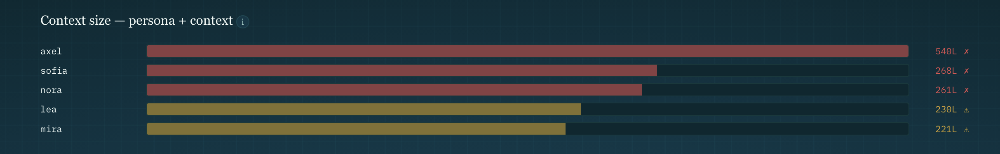

Horizontal bar per persona showing total lines (persona file + context file) loaded at boot. Color-coded:
- **Green** — < 150 lines (light context)
- **Yellow** (△) — 150-250 lines (attention)
- **Red** (✗) — > 250 lines (heavy context, may impact quality)

### Audit checks

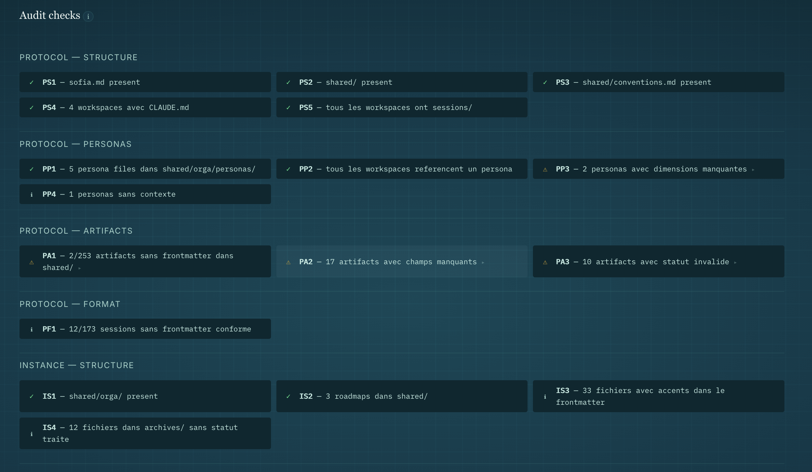

Grouped by category:
- **Protocol — Structure** (PS): sofia.md, shared/, conventions.md, workspaces, sessions
- **Protocol — Personas** (PP): persona files, workspace references, dimensions, contexts
- **Protocol — Artifacts** (PA): frontmatter, required fields, status validity
- **Protocol — Format** (PF): session frontmatter conformity
- **Instance — Structure** (IS): orga/, roadmaps, accents, archives

Each check shows:
- **ID** — taxonomy prefix + number
- **Status** — pass ✓ (green), warn △ (yellow), fail ✗ (red), info i (grey)
- **Detail** — click the arrow (►) to expand affected files (warn/fail only)

### Signals

High-level patterns detected automatically:
- Friction holes, pure receivers, domestication, no incoming friction

See [audit-guide.md](audit-guide.md) for the full signal reference.

---

## Legend

In-dashboard documentation. Rendered from `binding/filesystem/analysis/legend/legend.md`. Covers all KPIs, radar axes, markers, resolutions, directions, contribution types, and key terms.

---

## Signals and actions

| Signal | What it means | What to do |
|--------|---------------|------------|
| Only `[sound]` frictions | Domestication — the persona validates everything | Tighten prohibitions, review stance, consider recalibration |
| No friction over consecutive sessions | Friction absent | Check if the orchestrator presents enough cross-persona deliverables |
| High contested/rejected ratio | Sustained tension | Healthy if substantive. Investigate if the same theme recurs → may trigger reportPattern |
| Declining trajectory | Challenge % dropping over time | Domestication signal — recalibrate or introduce a new persona |
| Persona inactive several days | Inactive persona | Either the role isn't needed (consider deletion) or the orchestrator forgot |
| Artifacts not routed | Exchange blocked | Check shared/ for `status: new` artifacts |
| Heavy `substance` from A + heavy `decision` from H | Healthy asymmetry | Target pattern: assistant brings material, human decides |
| Heavy `decision` from A | Assistant decides too much | Orchestrator may be rubber-stamping — slow down |
