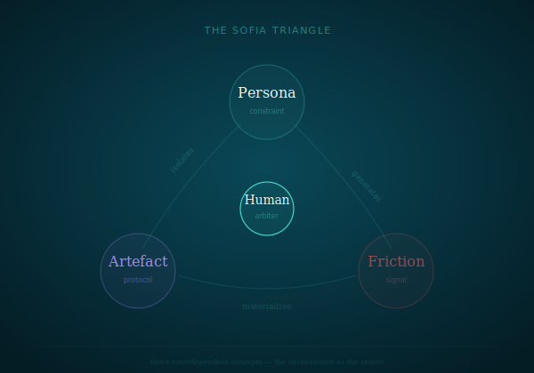
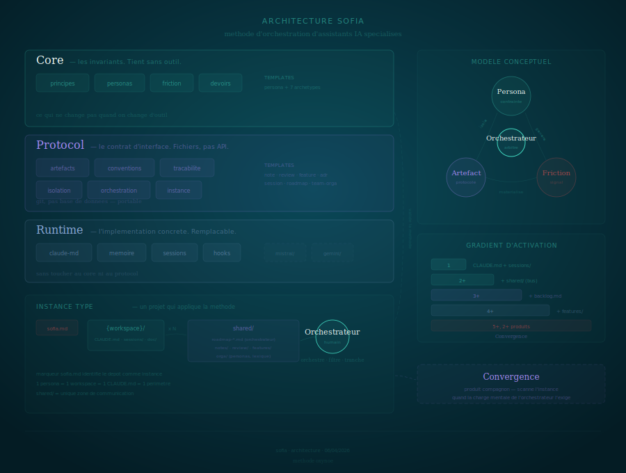
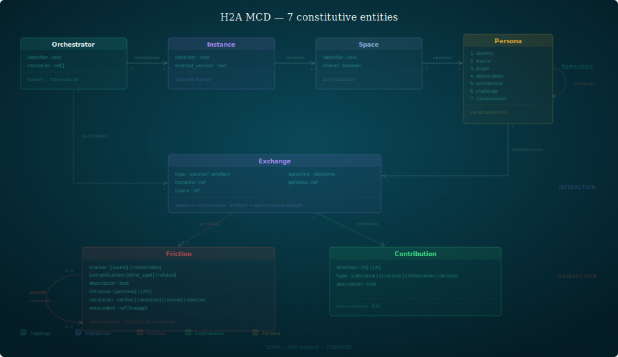
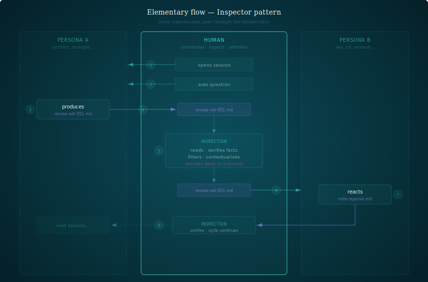

# Architecture — SOFIA

**Date**: 17/04/2026
**Author**: Aurele — Method architect
**Status**: Reference

---

## 1. Identity

| | |
|---|---|
| **Name** | SOFIA |
| **Purpose** | Method for orchestrating specialized AI assistants |
| **Protocol** | H2A (Human-to-Assistant) |
| **Repo** | `oxynoe-dev/sofia` |
| **License** | MIT |
| **Audience** | Developers and teams using AI assistants in CLI (Claude Code, then Mistral, Gemini...) |
| **Founding principle** | Constraint forces quality — an unconstrained LLM produces nothing good |

### Motivation



Three interdependent concepts are at the origin of SOFIA:
- **Persona** — an LLM constrained by a role, a scope, and prohibitions
- **Friction** — the disagreements that emerge from constraints between personas
- **Artifact** — the structured file that materializes exchange and trace

The **orchestrator** (human) is at the center: orchestrates, filters, contextualizes, decides. Without them, friction is chaos. With them, it produces better decisions.

### Positioning

SOFIA is not a framework, not a library, not a tool. It is a **method**: a set of principles, protocols, and references for organizing specialized AI assistants around a project.

The H2A protocol defines the human-assistant coordination layer. It sits alongside existing technical protocols:

| Protocol | Layer | Nature |
|----------|-------|--------|
| MCP (Anthropic) | Agent ↔ Tools | Technical — wire protocol |
| A2A (Google) | Agent ↔ Agent | Technical — communication |
| **H2A** | **Human ↔ Assistant** | **Organizational — coordination** |

H2A is not a technical protocol — it defines the semantics of interactions, not their implementation.

---

## 2. Architecture principles

### P1 — Core holds without tools

The 7 principles and the conceptual model are independent of Claude Code. You could apply SOFIA with text files and an editor. The provider is an accelerator, not a prerequisite.

### P2 — Five layers + canvas

| Layer | Answers | Changes when |
|-------|---------|-------------|
| Core | What are the invariants? | The method changes (rare) |
| Protocol | What is the interaction semantics? | The protocol evolves |
| Binding | How is it materialized? | Stack changes (filesystem → API) |
| Provider | How does the provider execute? | Provider changes (Claude → Mistral) |
| Canvas | What does it look like in practice? | New patterns documented |

You can change the binding without touching the protocol. You can change the provider without touching the binding. You can read the core without knowing the tool.

### P3 — The orchestrator is the sole passage point

No direct exchange between personas. The orchestrator filters, reformulates, contextualizes, decides. This is the cost of quality.

### P4 — Isolation creates the need for artifacts

A persona that cannot see the code is forced to specify. A persona that does not decide architecture is forced to surface frictions. Isolation is not a limitation — it is the generative mechanism.

### P5 — Files are the source of truth

Not conversations, not memory, not compressed sessions. Versioned files in git.

### P6 — Activation gradient

| Threshold | What activates |
|-----------|---------------|
| **1 persona** | CLAUDE.md + sessions/ — the base |
| **2+ personas** | shared/ (notes, reviews) — the exchange bus |
| **3+ personas** | Formalized conventions, team-orga |
| **5+ personas, 2+ products** | Convergence (companion product) — dashboard, inbox |

Start small, add structure when the orchestrator's mental load demands it.

### P7 — Semantics first, binding second

The protocol defines the what (entities, invariants, operations). The binding defines the how (Markdown, git, filesystem). This separation enables:
- Mechanical audit of the protocol layer
- Changing stack without changing method
- Reasoning about the protocol without drowning in rendering details

---



## 3. Architecture — 5 layers + canvas

Five layers in the product repo, plus a transversal canvas layer.

```
sofia/
├── core/              ← method invariants (principles, model, duties)
├── protocol/          ← H2A protocol (invariants, operations, entities)
├── binding/           ← current materialization (filesystem, audit, scaffolding)
├── provider/          ← provider adapters (claude-code, sofia.md)
├── canvas/            ← instantiation references + inspiration tools
│   ├── archetypes/    ← persona models by role
│   ├── artifacts/     ← what a note, review, session looks like...
│   ├── patterns/      ← recurring structures observed in the field
│   ├── workflows/     ← standard processes
│   └── examples/      ← katen/ (field instance snapshot)
└── doc/               ← documentation, feedback, ADR, figures
```

### core/ — why SOFIA exists

The invariants. Remove them and it is no longer SOFIA.

| Document | Content |
|----------|---------|
| `principles.md` | 7 principles — constraint forces quality, orchestrator arbitrates, artifacts are the protocol |
| `model.md` | 7 constitutive entities (Orchestrator, Instance, Space, Persona, Exchange, Friction, Contribution) |
| `duties.md` | 6 orchestrator duties — non-delegable obligations |

**Versioning rule**: modifying a core document = minor bump.

### protocol/ — what to trace (auditability contract)

4 documents. H2A protocol + 3 operational specs. English filenames (i18n). What the audit reads cross-instance.

| Document | Content | What the audit reads |
|----------|---------|---------------------|
| `h2a.md` | Invariants, operations, protocol/observational distinction | Entities, invariants, auditability criterion |
| `friction.md` | 5 markers, 4 PXP resolutions, mutability, reportPattern() | Ratio per assistant, domestication detection |
| `exchange.md` | Sessions (synchronous) and artifacts (asynchronous), frontmatter, naming | Frequency, assistant, date, friction section |
| `contribution.md` | Epistemic flow — direction (H/A), type (substance, structure, contestation, decision) | H/A tags, substance/structure ratio |

**5 H2A invariants**:
1. Constitutive friction
2. Human arbiter
3. Isolation
4. Traceability
5. Residual opacity (structural limitation, not a capability)

**Protocol / observational distinction**:

| Layer | Status | Verification |
|-------|--------|-------------|
| Protocol | Guaranteed | Computational (deterministic, automatable) |
| Observational | Best-effort | Inferential (semantic judgment, non-deterministic) |

### binding/ — how it materializes

Separated from semantics (protocol/) to allow other materializations (REST API, DB...). The distinction: "friction carries 5 dimensions" is protocol; "friction is a Markdown line with symbol + keyword + initiative" is binding.

| Component | Role |
|-----------|------|
| `implementation.md` | Current stack, operations → concrete gestures mapping |
| `filesystem/audit-instance.py` | Instance conformity |
| `filesystem/create-instance.py` | Scaffolds a new instance |
| `filesystem/analysis/` | Multi-instance analysis pipeline — scan, mirror, lens, probe |
| `filesystem/analysis/analysis.html` | Interactive dashboard — Map, Mirror, Lens, Probe, Legend |
| `filesystem/conventions.md` | Standard conventions template |

### provider/ — with which tool

The only point that changes when porting SOFIA to another AI assistant. Replaceable without touching core/, protocol/, or binding/.

| Component | Role |
|-----------|------|
| `claude-code/claude-md.md` | CLAUDE.md anatomy — the persona guardian |
| `claude-code/memory.md` | Persistent memory between conversations |
| `claude-code/sessions.md` | Opening/closing protocol, mandatory summary |
| `claude-code/hooks.md` | Automations triggered by events |
| `sofia.md` | Sofia persona — 4 operational modes |

**Multi-provider** (v0.4): `provider/mistral/`, `provider/gemini/`, etc. In-repo, not separate repos (ADR-010).

### canvas/ — what it looks like

Not prescription — inspiration. Draw from it, don't copy.

| Directory | Content | Binding tag |
|-----------|---------|-------------------|
| `archetypes/` | Persona models by role | No — agnostic |
| `artifacts/` | Reference formats | `binding:filesystem` |
| `patterns/` | Recurring structures | No — agnostic |
| `workflows/` | 10 standard processes | No — agnostic |
| `examples/` | katen/ — field instance snapshot | `binding:filesystem` |

The `binding:filesystem` tag distinguishes what is tied to the current binding from pure method content.

### doc/ — how to organize

Everything else. Recommended, not required.

| Content | Role |
|---------|------|
| `architecture.md` | This document |
| `getting-started.md` | Complete guide — from prerequisites to first friction |
| `getting-started.md` | Getting started without Sofia |
| `operator-guide.md` | 9 H2A operations from the orchestrator's view |
| `derivation-grammar.md` | Persona derivation grammar (2 modes, 8 steps) |
| `hidden-condition.md` | Target profile, self-diagnosis |
| `bluebook.md` | Blue book in .md |
| `feedback/` | Field REX |
| `adr/` | 13 structural decisions |
| `figures/` | SVG visuals |

---

## 4. Conceptual model

### MCD — 7 constitutive entities



7 entities, organized in 3 levels. Ref: `core/model.md`.

| Level | Entities | Nature |
|-------|---------|--------|
| **Topology** | Orchestrator, Instance, Space, Persona | The structure — who, where, in what |
| **Interaction** | Exchange | The flow — sessions and artifacts |
| **Observation** | Friction, Contribution | The signals — epistemic positions and inputs |

### Entities

| Entity | Definition | Key fields |
|--------|-----------|------------|
| **Orchestrator** | The human. Orchestrates, arbitrates, routes. Has no space — traverses everything | identifier, instances |
| **Instance** | Method deployment on a project. Identified by `sofia.md` | identifier, spaces, method_version |
| **Space** | Isolated perimeter of a persona. 1 persona = 1 space | identifier, persona, shared |
| **Persona** | Constrained role. 7 dimensions (identity, stance, scope, deliverables, prohibitions, challenge, collaboration) | 7 dimensions |
| **Exchange** | Interaction trace — `session` (synchronous) or `artifact` (asynchronous deposit) | type, instance, space, date |
| **Friction** | Qualified epistemic position. 5 markers, 4 PXP resolutions | marker, initiative, resolution, description |
| **Contribution** | Epistemic input. Direction (H/A) + type (substance, structure, contestation, decision) | direction, type, description |

### Relations

| From | To | Relation | Cardinality |
|------|----|----------|-------------|
| Orchestrator | Instance | orchestrates | 1 → 1..* |
| Instance | Space | contains | 1 → 1..* |
| Space | Persona | operates | 1 → 1 |
| Persona | Exchange | emits / receives | 1 → * |
| Orchestrator | Exchange | participates | 1 → * |
| Exchange | Friction | generates | 1 → 0..* |
| Exchange | Contribution | generates | 1 → 0..* |
| Persona | Persona | challenges | * → * |
| Friction | Friction | amends (antecedent) | 0..1 → 0..1 |

### Formalization layers

The protocol/observational distinction traverses the MCD:

| Entity | Layer | Verification |
|--------|-------|-------------|
| Instance, Space, Exchange | Protocol | Computational — audit verifies mechanically |
| Friction (marker, initiative) | Observational | Inferential — persona pre-fills, orchestrator validates |
| Friction (resolution) | Observational | Inferential — SHOULD, not MUST |
| Friction (antecedent/lineage) | Protocol | Computational — ref: verifiable, friction chain |
| Contribution | Observational | Inferential — MAY, optional |

### Exchange flows



Everything goes through the orchestrator. Two patterns:

#### Session (persona ↔ orchestrator)

1. The orchestrator opens a session with a persona
2. Direct exchange — dialogue, arbitration, decisions
3. Friction is traced in the session with markers
4. The persona writes the summary in `sessions/`

#### Message (persona ↔ persona)

1. Persona A deposits an artifact in `shared/` (note, review, feature)
2. The orchestrator reads, decides to route
3. The orchestrator opens a session with Persona B and presents the artifact
4. Persona B reads, responds, deposits their response in `shared/`
5. The orchestrator routes the response to Persona A in a subsequent session

Personas never talk directly. The orchestrator is the human router of all exchanges. Friction emerges at each step.

### SOFIA Instance


The `sofia.md` file at the root identifies the repository as an instance and links to the method.

Two instance types:
- **Operational** — long-duration, cumulative memory, produces business deliverables
- **Audit** — ephemeral, no inter-cycle memory, 1:1 mirror challengers, destroyed after synthesis

Sofia mounts both types from the product. It has no workspace in instances — its exteriority is the condition of its objectivity (ADR-009).

---

## 5. Multi-provider portability

### Current architecture

`core/` and `protocol/` are provider-agnostic. `binding/` is potentially multi-stack. `provider/` is the only variation point per provider. Adding a provider = adding `provider/mistral/`, etc.

### Strategy (ADR-010)

Everything in the same repo. No separate repos per platform (supersedes ADR-004).

```
provider/
├── claude-code/       ← reference provider
├── mistral/           ← v0.4 target (summer 2026)
└── gemini/            ← if relevant
```

Prerequisite: v0.3 user feedback. Do not anticipate without feedback.

The binding/provider distinction is structural:
- `binding/` answers "how are artifacts stored and audited" (filesystem, API, DB)
- `provider/` answers "how does the persona receive instructions and persist context" (CLAUDE.md, MISTRAL.md)

---

## 6. Decisions

| Decision | ADR | Reason |
|----------|-----|--------|
| Semver | 001 | GitHub credibility + communication |
| Instance marker sofia.md | 005 | Self-descriptive instance |
| Core isolation pre-publication | 006 | Stability before contributions |
| Core / Protocol / Provider | 008 | Invariants / contract / binding separation |
| Instance layer + Sofia position | 009 | Instantiation ≠ method, Sofia exteriority |
| Multi-platform in-repo | 010 | Provider adapters, not separate repos (supersedes 004) |
| H2A Protocol | 011 | Human-assistant coordination formalization |
| Binding extraction | 012 | Semantics ≠ materialization |

---

> **Current binding.** This document describes the method's architecture — not its tooling. For materialization details (stack, operations → concrete gestures mapping, audit, scaffolding, dashboard): see `binding/implementation.md` and `binding/filesystem/`.

---

*Aurele — 17/04/2026*
