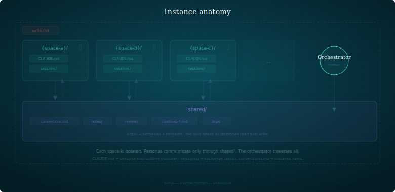
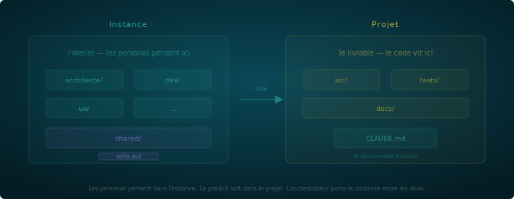

# Getting started with SOFIA

> From prerequisites to your first friction — one document, everything you need.

---

## Prerequisites

**What you need**:
- A machine with a terminal (macOS, Linux, or WSL on Windows)
- A code editor (VS Code recommended — Claude Code integrates as an extension)
- Git installed
- Node.js installed (for Claude Code)

**Install Claude Code** (reference provider):
```bash
npm install -g @anthropic-ai/claude-code
```

SOFIA is provider-agnostic — the method works with any AI tool that can read a persona file and follow system instructions. With another provider (Mistral, Gemini, manual mode): copy the persona and context files as system instructions in your tool.

---

# Part 1 — Understanding the method

## What SOFIA is — in one minute

A method for orchestrating specialized AI assistants on a project. Each assistant has a role, a scope, and prohibitions. They don't talk to each other — you carry the context between them. Friction between roles produces better decisions.

Five things to know before you start:

1. **One persona = one strict role.** Define what it does NOT do before what it does. Constraint creates useful friction.
2. **Friction is productive.** If all personas agree, they're useless. Disagreements are the mechanism.
3. **The orchestrator decides. Always.** Personas propose, challenge, produce. You decide.
4. **Files are the protocol.** Personas exchange through artifacts (notes, reviews, specs), not chat. Slowness forces clarity.
5. **Start small, iterate.** One persona at launch. Others emerge from the work.

## How personas work

### One persona = one strict role

A persona is not a generic assistant. It is a constrained LLM: a name, a tone, a scope, and above all things it is **not allowed to do**.

Constraint changes everything. An architect who doesn't code is forced to specify. A developer who doesn't decide architecture is forced to question. A strategist without code access thinks in value, not implementation.

Define what the persona **does not do** before defining what it does.

### Friction is the mechanism

If all your personas agree, they're useless. Friction — an architect challenging the dev, a strategist questioning the priority — is the mechanism that produces better decisions.

Friction without an arbiter is chaos. The arbiter is you. You listen, question, then decide. A persona never validates its own proposals. A persona never forces acceptance of a decision.

### Isolation — each persona in its space

Each persona operates in its own workspace. It sees only its files. It cannot read or write elsewhere. Isolation forces formal exchanges: to communicate, personas deposit artifacts in a shared space (`shared/`).



The orchestrator is the only one who crosses boundaries — carrying context, filtering, reformulating.

### Files are the protocol

Personas don't "discuss" — they exchange through **artifacts**: reviews, notes, specs. These artifacts are versioned, traceable, and readable by all. File-based exchange is slower than chat. That's the point. Slowness forces clarity.

### Emergence — personas appear from the work

Subsequent personas are not planned. They emerge from the work. Every persona includes an **Emergence** section:

> *When you deflect a question because it's outside your scope, note the domain. If you deflect 3+ times on the same domain, signal it explicitly.*

The persona doesn't create the new persona — it signals the gap. You decide whether to act on it.

**Concrete example**: you're working with an architect. After a few sessions, it tells you 3 times "I don't code, you'd need someone to implement." That's the signal — a dev persona is needed. Not because you planned it, but because the work revealed the gap.

### Traceability — if it's not traced, it doesn't exist

Every session produces a structured summary (Produced, Decisions, Shared notes, Open). The summary is the bridge to the next session — the persona reads it at opening. Without it, continuity is lost.

Decisions are traced in ADRs (context, decision, alternatives, consequences). Exchanges are traced in artifacts with frontmatter (who, to whom, nature, status, date).

### The "no" test

A well-calibrated persona says "no" regularly:
- "That's not my role, check with [other persona]"
- "The spec isn't precise enough for me to code"
- "This decision needs an ADR before I implement"

If your persona never says no, its constraints are too loose.

## Instance and project

A **SOFIA instance** is not your project. It's the space where personas think. Your **project** (code, product, site) lives elsewhere.



The instance thinks. The project delivers. Personas work in the instance and produce deliverables that land in the project. Commits in the instance are automatic. Commits in the project go through the orchestrator.

Three configurations:

| Config | When |
|--------|------|
| **Single repo** — instance lives in a subfolder of the project | Simple to start, separate when the need arises |
| **Instance repo + project repo** — the standard case | Analysis history doesn't pollute the product repo |
| **Instance repo + multiple projects** — cross-cutting personas | Roadmaps in shared/ make the link |

## Orchestration — the orchestrator's role

### You are the message bus

Personas don't talk to each other. You carry the context. You can open multiple terminals in parallel — one per persona — to accelerate exchanges:

1. You open a session with a persona
2. It produces a deliverable
3. You close the session
4. You open a session with another persona
5. You transmit the deliverable
6. You collect the reaction

Each transmission is a moment where you filter, reformulate, add context, decide what is relevant to transmit.

### What you don't delegate

- **Prioritization** — which persona intervenes, in what order
- **Consolidation** — synthesizing feedback from N personas
- **Decision** — deciding when personas diverge
- **Filtering** — what is relevant to transmit or not

### The cost

Orchestration takes time. It's the price of quality. If the exchange isn't worth the cost, the subject didn't need multiple personas.

## Anti-patterns

| Pattern | Problem |
|---------|---------|
| The generalist persona | Does everything, therefore nothing well |
| The compliant persona | Says yes to everything, never challenges |
| The double hat | "Architect who also codes" — blurs the constraint |
| Too many personas too early | Start with 1, not 5 |
| The ghost persona | Created but never used — delete it |
| No isolation | Without boundaries, the persona overflows |
| Approving without reading | When you rubber-stamp, you've stopped orchestrating |

---

# Part 2 — Setting up an instance

Two paths to the same result. Choose the one that fits.

## Path A — Guided by Sofia

> **Alpha** — Sofia relies on the provider's conversational behavior. Results may vary.

```bash
git clone https://github.com/oxynoe-dev/sofia
cd sofia
claude
> hello
```

Sofia presents a menu with 4 modes:

> 1. **Create an instance** — I guide the setup (structure, conventions, personas)
> 2. **Add a persona** — a new voice in an existing instance
> 3. **Recalibrate** — adjust an existing persona
> 4. **Audit** — compliance diagnostic + frictions

Choose **1. Create an instance**. Sofia then:

1. **Locates the instance** — asks where to create it, and where your project repo lives
2. **Understands your project** — asks what you're building (1-2 turns)
3. **Proposes personas in tension** — at least 2, directly proposed based on your project's axes of tension. Not a list of choices — a proposal you validate or adjust
4. **Calibrates** — name, stance, scope, prohibitions for each persona. Sofia proposes, you adjust
5. **Generates the files** — persona sheets, contexts, CLAUDE.md, conventions, workspace structure

After generation: your personas will say no (by design), other personas will come (when the work makes them emerge), and you can relaunch Sofia anytime (mode 2 to add, mode 3 to recalibrate).

> If the flow doesn't start or drifts, switch to Path B.

---

## Path B — Manual setup

### Step 1 — Clone the SOFIA repo

```bash
git clone https://github.com/oxynoe-dev/sofia
```

This is your reference — templates and documentation. You don't need to keep it in your project.

### Step 2 — Create the instance marker

At your project root (or instance root), create `sofia.md`:

```markdown
# SOFIA Instance

This repository is an **instance of the SOFIA method**.

- **Method**: [oxynoe-dev/sofia](https://github.com/oxynoe-dev/sofia)
- **Applied method version**: v0.3.x
- **Project**: {your project}
- **Team**: {number} AI assistants + 1 human orchestrator

## Instance structure

| Directory | Role | Persona |
|-----------|------|---------|
| `{workspace}/` | {description} | {persona} |
| `shared/` | Inter-persona exchange bus | Shared |
```

### Step 3 — Create the shared structure

```bash
mkdir -p shared/orga/personas shared/orga/contextes shared/notes shared/review
```

Create `shared/conventions.md` — the exchange contract between personas:

```markdown
# Conventions

## Inter-persona exchanges

Personas don't talk to each other. They exchange through artifacts in shared/.

### Notes
- Format: `note-{to}-{subject}-{from}.md`
- Location: `shared/notes/`
- When processed: move to `shared/notes/archives/`

### Reviews
- Format: `review-{subject}-{from}.md`
- Location: `shared/review/`
- When processed: move to `shared/review/archives/`

## Commits
- Instance: `{persona}: {short summary} ({date})`
- Product repos: the orchestrator verifies and commits
```

**Artifact types**:
- **Note** — a message between personas: a signal, a question, a request. Short, directional (from → to). Example: `note-dev-design-tokens-architect.md`
- **Review** — a persona takes a position on another's work. Carries friction markers. Example: `review-api-spec-v2-dev.md`
- **Feature** — a shared functional spec. Not directional. Example: `feature-export-pipeline.md`

Each artifact carries a YAML frontmatter (`from`, `to`, `nature`, `status`, `date`). When processed, it migrates to `archives/`.

### Step 4 — Define your first persona

Start with **one**. Others will come.

Create `shared/orga/personas/persona-{name}.md`. A persona has 7 dimensions:

```markdown
# {Name} — {Role}

## Profile
{Who this persona is, in one sentence.}

## Stance
{How it relates to you — formal? direct? cautious?}

## Scope
- {domain 1}
- {domain 2}

## What they produce
- {deliverable type 1}
- {deliverable type 2}

## What they do NOT do
- {prohibition 1 — the most important section}
- {prohibition 2}

## What they challenge
- {friction axis 1}

## Collaboration
| With | Mode |
|------|------|
| {other persona} | {how they interact} |
```

The "What they do NOT do" section is **the most important**. It creates the productive constraint.

Then create `shared/orga/contextes/contexte-{name}-{product}.md` — the workspace-specific contract:

```markdown
---
persona: {name}
product: {product}
---

# Context {Name} — {Product} ({workspace})

## Scope
This workspace contains: {content description}

## Key documents
| File | Role |
|------|------|
| `{path}` | {description} |

## Isolation
- Never read/write outside `{authorized scope}`

## Workflow
0. Read the latest summary in `sessions/`
1. Read existing documents before any intervention
2. Produce {deliverables}

## Emergence
When you deflect 3+ times on the same domain, signal it.

## Session protocol — mandatory
Summary: `sessions/{YYYY-MM-DD}-{HHmm}-{name}.md`
Sections: Produced, Decisions, Shared notes, Open
```

The persona says **who you are**. The context says **where you are**.

### Step 5 — Create the workspace

```bash
mkdir -p {workspace}/sessions
```

Create `{workspace}/CLAUDE.md` — a 2-line provider routing:

```markdown
Whatever the user's first message, at session opening, before any response, read these two files:
- `shared/orga/personas/persona-{name}.md`
- `shared/orga/contextes/contexte-{name}-{product}.md`
```

That's it. Content lives in the persona and context, not in the CLAUDE.md.

### Step 6 — First session

```bash
cd {workspace}
claude
> hello
```

The persona reads its CLAUDE.md, loads the persona and context, reads the latest session summary, and is ready to work. Give it a real task — not a test.

**Calibration signals**:
- **It refuses what's out of scope?** Good — the prohibitions work.
- **It accepts everything?** Tighten the prohibitions.
- **It's too rigid?** Soften the stance.
- **It doesn't know its workspace?** Enrich the context.

Calibration takes 2-3 sessions. That's normal.

### Session closing

When you're done, give the signal ("let's close"). The persona produces a summary:

```
sessions/2026-04-21-1430-architect.md
```

Mandatory sections: `## Produced`, `## Decisions`, `## Shared notes`, `## Open`. No prose — short lists, 30 lines max.

Commit (if using git):
```
architect: first session — scope definition + ADR-001 (2026-04-21)
```

### Adding a second persona

When the need emerges — not before. SOFIA's value starts at 2 personas — a single persona generates no friction.

**Signals**:
- **Repeated deflection** — the first persona tells you "that's not my role" 3+ times on the same domain.
- **Quality gap** — the persona produces something adequate but shallow. A dedicated role would do better.
- **Two domains in tension** — you spend time arbitrating between concerns that belong to different axes.

Go back to step 4. The new persona must be **in tension** with the existing one.

For the full derivation process, see [Derivation grammar](../concepts/derivation-grammar.md).

### Checklist

- [ ] Prerequisites installed (terminal, VS Code, Claude Code, git)
- [ ] `sofia.md` at root
- [ ] `shared/conventions.md`
- [ ] `shared/orga/personas/persona-{name}.md` (7 dimensions)
- [ ] `shared/orga/contextes/contexte-{name}-{product}.md`
- [ ] `{workspace}/CLAUDE.md` (2-line routing)
- [ ] `{workspace}/sessions/`
- [ ] First session launched
- [ ] The persona says "no" when it should

---

# Part 3 — Adding a persona to an existing instance

Two paths, same result.

## With Sofia (mode 2)

Relaunch Sofia and choose **2. Add a persona**:

```bash
cd sofia/
claude
> hello
> 2
```

Sofia then:

1. **Reads the existing team** — personas, contexts, conventions
2. **Asks what triggers the need** — a persona that deflects? a recurring tension? a domain nobody covers?
3. **Proposes a persona in tension** — in tension with at least one existing persona (otherwise no friction)
4. **Calibrates** — name, stance, scope, prohibitions
5. **Generates 3 files** — persona sheet, context, CLAUDE.md + workspace
6. **Announces** — deposits a note in shared/notes/ so other personas discover the new one at their next boot

> If Sofia flags "that looks like a task, not a role" — listen. A persona is a permanent role with prohibitions, not a one-off executor.

## Manual onboarding

### Example: onboarding Sofia (Katen, March 2026)

Sofia (visual production) was onboarded by Nora (UX):
1. **Persona file** defined with stance "the detail makes the product"
2. **Workspace** `graphisme/` created with specific CLAUDE.md
3. **Brief**: targeted reading list (design-principles, design-system, feature-v022)
4. **First session**: visual exploration, reference board v1

The brief was a dedicated document (`onboarding-sofia.md`) — short, ordered, with references to existing docs rather than duplicated content. The entire process took one session.

## When to add a persona?

A persona is justified when:
- A **domain** emerges that nobody covers correctly
- Two existing personas are in **tension** on a recurring subject
- The orchestrator spends time doing work a persona could structure

A persona is **not** justified when:
- It's a task, not a role (use a note or backlog item)
- The domain is covered but "not well enough" (improve the existing persona)

## Steps

### 1. Define the role

Before naming the persona, define:
- **What** — what types of deliverables it produces
- **Not what** — what it explicitly does not do (the most important)
- **With whom** — its main interactions

### 2. Create the persona file

Draw from the format in [`canvas/artifacts/persona.md`](../../canvas/artifacts/persona.md) and archetypes in [`canvas/archetypes/README.md`](../../canvas/archetypes/README.md). Key fields:
- Profile, stance, scope
- Collaboration (with/mode table)
- What it does not do

### 3. Create the workspace

```
{instance}/
├── shared/orga/
│   ├── personas/persona-{name}.md
│   └── contextes/contexte-{name}-{product}.md
└── {workspace}/
    ├── CLAUDE.md      ← 2-line routing
    └── sessions/
```

### 4. Brief the persona

At the first session, the persona must:
1. Read its persona file
2. Read key documents in its domain
3. Scan `shared/notes/` for any messages
4. Deposit a first session summary

### 5. Introduce to the rest of the team

Deposit a note in `shared/notes/`:
```
note-team-new-persona-{author}.md
```
Content: who, why, what scope, who it interacts with. Other personas will discover it at their next session opening.

## Onboarding anti-patterns

- **The catch-all persona** — "it does a bit of everything". If you can't say what it doesn't do, it's not calibrated.
- **The orphan persona** — no interaction with others. An isolated persona generates no useful friction.
- **The mirror persona** — it does the same thing as another with a different name. Merge rather than duplicate.

---

# Going further

### The method

- [Principles](../../core/principles.md) — the 7 invariant principles
- [Model](../../core/model.md) — the 7 constitutive entities
- [Duties](../../core/duties.md) — non-delegable orchestrator responsibilities
- [Architecture](../concepts/architecture.md) — 5 layers + canvas
- [Hidden condition](../concepts/hidden-condition.md) — target profile, cognitive trait
- [Derivation grammar](../concepts/derivation-grammar.md) — how personas come into existence

### The protocol

- [H2A](../../protocol/h2a.md) — the coordination protocol
- [Friction](../../protocol/friction.md) — markers, resolutions, lineage
- [Exchange](../../protocol/exchange.md) — sessions, artifacts, routing
- [Contribution](../../protocol/contribution.md) — epistemic flow

### The provider

- [CLAUDE.md anatomy](../../provider/claude-code/claude-md.md) — the 3-layer routing
- [Sessions](../../provider/claude-code/sessions.md) — session summary format
- [Memory](../../provider/claude-code/memory.md) — persistent memory between sessions

### Inspiration

- [Archetypes](../../canvas/archetypes/README.md) — persona templates by role (with prohibition summary)
- [Artifact formats](../../canvas/artifacts/README.md) — note, review, feature, ADR... (with frontmatter reference)
- [Patterns](../../canvas/patterns/) — challenger, inspector, memory, media calibration
- [Workflows](../../canvas/workflows/) — dev, publication, ADR, research, onboarding
- [Field feedback](../feedback/) — experience reports (N=1)
- [Glossary](../reference/lexique.md) — all SOFIA terms defined
