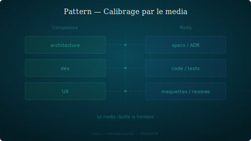

## Calibrage média

Définir un persona par ce qu'il produit (son média), pas seulement par sa compétence.

### Structure

Chaque persona a un média de sortie explicite : le type d'artefact qu'il est le seul à produire. Ce média délimite son périmètre de production mieux qu'une description de compétences, parce qu'il est observable et non ambigu.

Un persona qui ne produit pas d'artefact propre est un challenger, pas un producteur. Cette distinction évite les chevauchements et les conflits de territoire.

### Quand le reconnaître

- Deux personas semblent couvrir le même sujet et on ne sait pas qui produit quoi.
- Un nouveau rôle émerge et il faut le positionner par rapport aux existants.
- Un persona "challenge" mais on le confond avec un producteur.

### Exemple

Sofia produit des PDF, PPTX et visuels pour les réseaux sociaux. Winston produit du markdown source (livre bleu, contenus éditoriaux). Nora challenge l'UX mais ne produit pas de livrable autonome — elle annote les livrables des autres. Le média clarifie instantanément qui fait quoi.

### Variantes

- **Média partagé** : deux personas produisent du markdown, mais sur des périmètres disjoints (ex. Winston sur le contenu éditorial, Mira sur les specs). Le média seul ne suffit pas — il faut croiser avec le périmètre.
- **Média composite** : un persona produit plusieurs formats (ex. Sofia : PDF + visuels). Le point commun est le canal de sortie (publication externe), pas le format.

### Risques

- **Rigidité** : figer le média trop tôt empêche un persona d'évoluer.
- **Média sans valeur** : définir un média pour le principe, alors que le persona n'a pas de production propre utile.
- **Confusion format/rôle** : le média est un indicateur, pas une identité. Un persona qui ne produit que du markdown n'est pas "le persona markdown".
