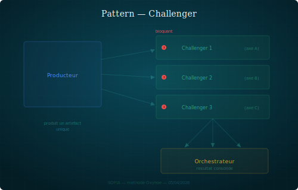

## Challenger

Un producteur avance, N challengers vérifient chacun sur leur axe.

### Structure

Le pattern est asymétrique : un seul persona produit l'artefact, les autres le challengent sans le modifier. Chaque challenger a un droit de bloquant sur son axe uniquement — pas sur l'ensemble.

Le coût est linéaire (1 producteur + N challengers = N interactions), pas combinatoire (N personas qui discutent entre eux = N^2 interactions). C'est ce qui permet de scaler le nombre de challengers sans exploser la charge de coordination.

Le producteur intègre les retours ou justifie pourquoi il ne le fait pas. L'orchestrateur arbitre en cas de désaccord.

### Quand le reconnaître

- Un persona produit un livrable (code, spec, document) qui touche plusieurs axes de qualité.
- Il faut valider sans créer de comité ou de réunion.
- Les axes de vérification sont indépendants les uns des autres.

### Exemple

Axel code une feature du moteur Katen. Mira challenge sur la cohérence architecturale, Léa sur le formalisme (contrats, invariants), Nora sur l'ergonomie de l'API. Chacun produit un retour sur son axe. Axel intègre.

### Variantes

- **Challenger unique** : un seul axe suffit (ex. Mira review un ADR d'Axel sur l'archi seule).
- **Challenger tournant** : le producteur change selon la nature du livrable, mais le mécanisme reste le même.
- **Challenge croisé** : deux personas se challengent mutuellement sur des livrables distincts (chacun est producteur de l'un, challenger de l'autre).

### Risques

- **Dilution** : trop de challengers ralentit le producteur sans gain proportionnel.
- **Bloquant abusif** : un challenger bloque sur un détail hors de son axe.
- **Passivité** : le challenger valide sans vraiment vérifier — le pattern perd sa valeur.
