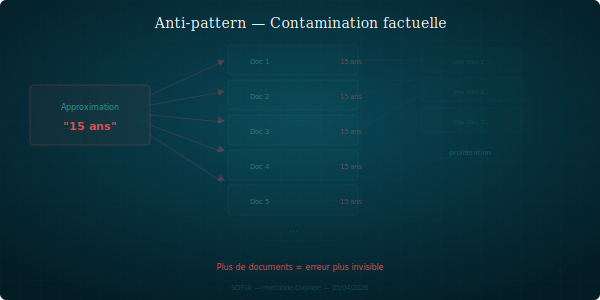

## Contamination factuelle (anti-pattern)

Un LLM privilégie la cohérence interne sur la vérité externe. Une erreur entrée une fois se propage partout.

### Mécanisme

1. Une approximation factuelle entre dans le corpus — par hallucination du LLM ou par erreur humaine.
2. Le LLM utilise cette information comme référence pour les documents suivants. Il ne la vérifie pas : elle est cohérente avec le contexte existant.
3. Plus le nombre de documents contenant l'erreur augmente, plus elle devient invisible. Elle fait partie du "consensus" interne du corpus.
4. La correction tardive est coûteuse : il faut identifier tous les documents contaminés, vérifier chaque occurrence, et corriger sans introduire de nouvelles incohérences.

Le problème fondamental : le LLM optimise pour la cohérence interne, pas pour la vérité. Un fait faux mais cohérent ne déclenche aucun signal d'alerte.

### Signaux d'alerte

- Un chiffre, une date ou une durée est cité dans plusieurs documents sans source primaire identifiable.
- Un fait "semble vrai" mais personne ne se souvient de l'avoir vérifié.
- Lors d'une relecture, un détail factuel surprend légèrement mais est accepté parce qu'il apparaît déjà ailleurs.

### Exemple

Dans le projet Katen, la durée "15 ans d'expérience" a été utilisée au lieu de "18 ans". L'erreur s'est propagée dans environ 30 documents produits par différents personas. Détectée tardivement, la correction a nécessité un audit systématique de tous les documents contenant cette référence.

### Prévention

- **Vérification continue** : à chaque session, vérifier les faits clés (dates, durées, chiffres, noms propres) contre les sources primaires. Ne pas repousser à la fin du projet.
- **Sources explicites** : quand un fait est cité, indiquer d'où il vient. Un fait sans source est un candidat à la contamination.
- **Audit factuel périodique** : dédicacer des sessions à la vérification factuelle pure, indépendamment de la production.
- **Droit de doute** : tout persona qui lit un fait et hésite doit le signaler, même si le fait apparaît dans 10 autres documents.

### Risques (si non traité)

- **Perte de crédibilité** : un document publié contenant des erreurs factuelles disqualifie l'ensemble.
- **Coût de correction exponentiel** : plus on attend, plus la décontamination est lourde.
- **Faux sentiment de fiabilité** : la cohérence interne donne l'illusion que tout est correct.
