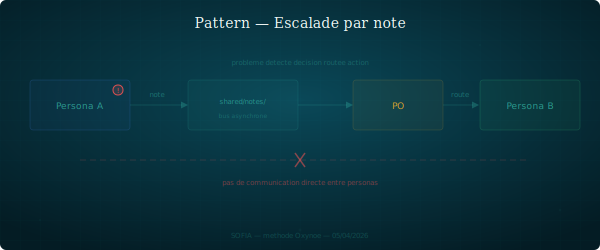

## Escalade par note

Quand un persona rencontre un problème hors de son périmètre, il dépose une note. L'orchestrateur route.

### Structure

1. Un persona identifie un problème qui ne relève pas de son axe.
2. Il rédige une note factuelle dans `shared/notes/` avec le format `note-{destinataire}-{sujet}-{auteur}.md`.
3. Il ne tente pas de résoudre le problème lui-même.
4. L'orchestrateur lit la note, ajoute le contexte nécessaire, et la transmet au persona compétent.
5. Le destinataire traite et répond via le même mécanisme si besoin.

Il n'y a pas de communication directe inter-personas. L'orchestrateur est le seul routeur. Cela préserve l'isolation des contextes et évite les boucles de coordination non supervisées.

### Quand le reconnaître

- Un persona bute sur une question qui sort de son périmètre.
- Deux personas auraient besoin de se coordonner sur un sujet transverse.
- Un problème détecté dans un workspace concerne un autre workspace.

### Exemple

Axel identifie une incohérence dans la spec CVM pendant l'implémentation. Il dépose `note-mira-incoherence-spec-cvm-axel.md` dans `shared/notes/`. L'orchestrateur lit, confirme le contexte, et ouvre une session avec Mira pour traiter le point. Mira corrige la spec ou justifie le choix existant.

### Variantes

- **Note informative** : pas de problème à résoudre, juste un signal (ex. "j'ai observé que..."). L'orchestrateur décide s'il y a suite.
- **Note urgente** : le persona signale un bloquant dans le titre. L'orchestrateur priorise.

### Risques

- **Engorgement orchestrateur** : trop de notes non traitées s'accumulent. L'orchestrateur doit trier régulièrement.
- **Sur-formalisme** : déposer une note pour un détail trivial que le persona pourrait ignorer.
- **Perte de contexte** : la note est trop courte et l'orchestrateur ne peut pas router correctement.
