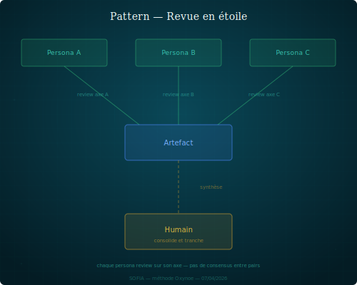

## Revue en étoile

Un artefact est soumis à N personas en parallèle, chacun le review sur son axe. L'orchestrateur consolide.

### Structure

1. L'orchestrateur identifie un artefact qui nécessite une validation multi-angle.
2. Il le soumet simultanément à N personas, chacun avec une consigne de review sur son axe propre.
3. Les personas produisent leurs reviews en parallèle, sans se lire mutuellement.
4. L'orchestrateur collecte les reviews, identifie les convergences et les contradictions, et consolide une décision.

La différence avec le pattern challenger : le challenger s'insère dans un flux de production séquentiel (le producteur intègre les retours). La revue en étoile est un mécanisme ponctuel de validation — les reviewers ne modifient pas l'artefact, l'orchestrateur tranche.

### Quand le reconnaître

- Un document structurant (ADR, spec, plan) doit être validé avant adoption.
- Plusieurs axes de qualité sont en jeu et aucun persona ne les couvre tous.
- On veut des regards indépendants, pas contaminés par les avis des autres.

### Exemple

L'orchestrateur soumet un ADR à Mira (cohérence avec l'architecture cible), Léa (rigueur formelle, références), et Marc (alignement stratégique). Chacun produit une review indépendante dans `shared/review/`. L'orchestrateur lit les trois, identifie un point de tension entre cohérence archi et stratégie, et tranche.

### Variantes

- **Étoile partielle** : seuls 2 axes sur N sont sollicités, selon la nature de l'artefact.
- **Étoile itérative** : après consolidation, l'artefact est amendé et resoumis pour un second tour.

### Risques

- **Redondance** : les reviewers couvrent involontairement le même terrain — perte de temps.
- **Paralysie** : les reviews divergent et l'orchestrateur n'arrive pas à trancher.
- **Faux parallèle** : les reviews sont lancées "en parallèle" mais en réalité séquentielles (un persona lit la review d'un autre avant de produire la sienne).
