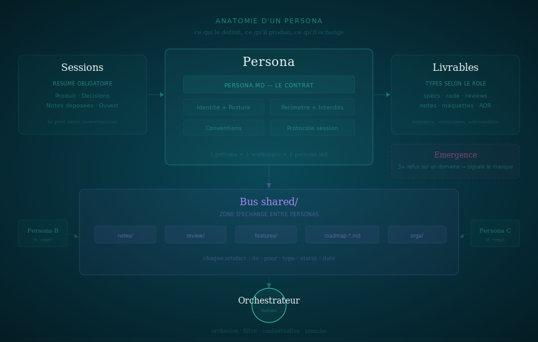
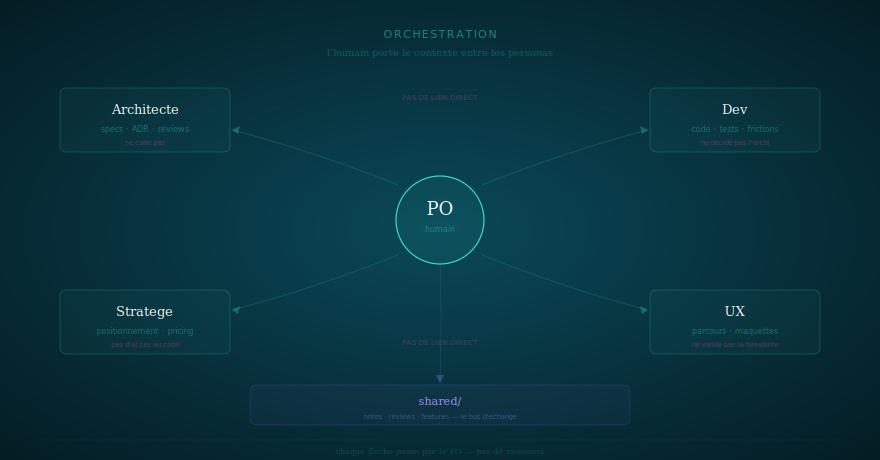
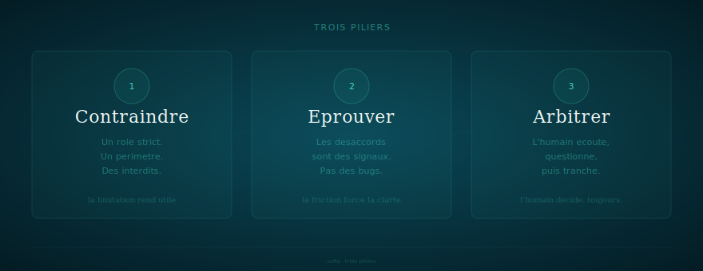
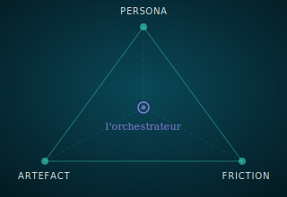

# The SOFIA method

> Specialized roles that think with you. The product emerges from their friction.

---

## Anatomy of a persona

A persona is an AI assistant constrained by an **instruction file** (`persona.md`) that defines its identity, stance, scope, and prohibitions.

Each persona operates in its own workspace. It sees only its files. It cannot read or write elsewhere. Isolation forces formal exchanges: to communicate, you must deposit an artifact.

### What surrounds a persona

**Sessions** — Each conversation produces a summary. It's the bridge between sessions: the next one starts by reading the previous one. Structured format, 30 lines max.

**Deliverables** — Each persona produces typed deliverables according to its role: specs, reviews, code, strategic notes, mockups. Not generic text — named, addressable, versioned artifacts.

**Exchanged artifacts** — Personas don't talk to each other. They deposit files in a shared bus (`shared/`). Notes, reviews, features — each with frontmatter that says who wrote it, for whom, and whether it's been processed.

**Emergence** — A well-constrained persona detects when a question falls outside its scope. After repeated deflections on the same domain, it signals the gap. The next persona is born from this observation, not from an initial plan.

---

## Orchestration

The orchestrator is the message bus. Nothing flows between personas without them.

The orchestrator opens a session with a persona, gets a deliverable, closes the session. Opens a session with another persona, transmits the deliverable, collects the reaction. Each transmission is a moment of filtering, reformulation, context addition.

**What the orchestrator does not delegate**:
- Prioritization — which persona intervenes, in what order
- Consolidation — synthesizing feedback from multiple personas
- Decision — deciding when personas diverge
- Filtering — what is relevant to transmit or not

It's slow. That's the cost of quality. If the exchange isn't worth the cost, the subject didn't need multiple personas.

---

## Three pillars

SOFIA rests on three ideas. They don't work without each other.

**Constrain** — An AI assistant without limits says yes to everything and produces nothing good. SOFIA gives each assistant a strict role, a scope, and above all prohibitions. It's the limitation that makes it useful.

**Challenge** — If all roles agree, nobody thinks. The friction between an architect who refuses to code and a developer who refuses to implement a vague spec is a signal, not a bug. Disagreements force clarity.

**Arbitrate** — Friction without an arbiter is chaos. The orchestrator listens, questions, then decides. Always. No assistant validates its own proposals. No assistant forces acceptance of a decision.

---

## The model

Three interdependent objects. The constrained persona produces artifacts. Artifacts create friction when challenged by other personas. Friction produces better decisions. The orchestrator steers the cycle.

### Pillars and concepts

The pillars say *why*, the concepts say *how*.

| Pillar | Concept | Link |
|--------|---------|------|
| **Constrain** | Persona | The persona is the vehicle of constraint — strict role, bounded scope, prohibitions |
| **Challenge** | Friction | Friction arises when constrained personas confront each other on the same subject |
| **Arbitrate** | Artifact | The artifact is the support of arbitration — traced, versioned, addressable. The orchestrator decides on evidence |

---

## Seven principles

| # | Principle | In brief |
|---|-----------|----------|
| 1 | Friction is productive | Disagreements between roles are signals |
| 2 | The orchestrator arbitrates | Assistants propose, the orchestrator decides |
| 3 | Every voice counts | An unused role is a role to remove |
| 4 | Constraint forces quality | Define what the role doesn't do before what it does |
| 5 | Artifacts are the protocol | Exchanges go through files, not chat |
| 6 | Everything is traced | If it's not traced, it doesn't exist |
| 7 | Start small, iterate | One role at the start. The others emerge from the work |

---

## The gradient

The method doesn't deploy as big bang. It grows with the project.

| Threshold | What activates |
|---|---|
| 1 persona | persona.md + sessions/ — the base |
| 2+ personas | shared/ — the exchange bus (notes, reviews) |
| 3+ personas | per-workspace roadmaps |
| 4+ personas | features/ — formalized specs |

Start small. Add structure when the orchestrator's cognitive load demands it.

---

## Five layers

The method is structured in five independent layers. You can change one without touching the others.

**Core** — The invariants. Principles, model, friction, duties. What doesn't change when you change tools. If Claude Code disappears tomorrow, core holds.

**Protocol** — The interface contract. H2A (Human-to-Assistant — the coordination protocol between a human orchestrator and constrained AI personas), exchanges, friction, contribution. The semantics of interactions, not their materialization.

**Binding** — The materialization. How the protocol takes form in a concrete persistence system (filesystem + Markdown + git today, REST API or database tomorrow).

**Provider** — The AI provider. CLAUDE.md, Claude Code, hooks, persistent memory. Replaceable without touching the rest. It's the only layer that changes when porting SOFIA to another provider.

**Canvas** — Tools so you don't start from scratch. Persona archetypes, artifact formats, patterns, workflows.

| Layer | Content | Changes when… |
|---|---|---|
| **Core** | principles, model, friction, duties | …the method evolves (rare) |
| **Protocol** | H2A, exchanges, friction, contribution | …the semantics of interactions evolve |
| **Binding** | filesystem stack, conventions, audit, dashboard | …you change persistence system |
| **Provider** | CLAUDE.md, hooks, sessions, memory | …you change AI provider |
| **Canvas** | archetypes, artifacts, patterns, workflows | …you add inspiration |

---

## Six orchestrator duties

Personas produce, challenge, document. But some responsibilities cannot be delegated.

1. **Verify facts** — LLMs don't count. Dates, numbers, references: systematic human verification.
2. **Arbitrate** — Listen, question, decide. The decision is traced.
3. **Read what goes out** — No document goes out without full review.
4. **Calibrate personas** — Adjust constraints continuously.
5. **Separate reflection and production** — The one who writes is not the one who validates.
6. **Maintain attention** — When you approve without reading, that's the moment to slow down.

---

## Field

The method was developed and validated on the Katen project — a formally verified orchestration engine for Data & AI pipelines, built with specialized AI personas across hundreds of sessions.

---

Continue → [Tutorial](tutorial.html) · [Documentation](documentation.html)
