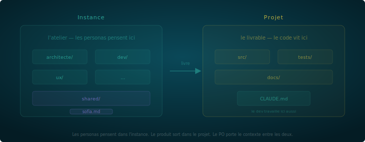

# Guide utilisateur Voix

> Des rôles spécialisés qui pensent ensemble. Le produit émerge de leur conversation.

---

## En une minute

Voix est une méthode pour orchestrer des assistants IA spécialisés sur un projet. Chaque assistant a un rôle, un périmètre et des interdits. Ils ne se parlent pas — c'est toi qui portes le contexte entre eux. La friction entre les rôles produit de meilleures décisions.

Pour commencer : clone le repo, lance `claude`, et Diapason — le guide intégré — te propose ton premier persona. Si le flow ne se lance pas, le [mode manuel](demarrer-manuel.md) couvre la même chose étape par étape.

> **Alpha preview** — Diapason repose sur le comportement conversationnel de Claude Code. Les résultats peuvent varier selon l'environnement.

```
git clone https://github.com/oxynoe-dev/voix
cd voix
claude
```

> Git n'est pas obligatoire pour utiliser Voix, mais il est fortement conseillé. Les résumés de session, les notes et les reviews sont des fichiers — git te donne la traçabilité et la persistence du contexte entre les sessions.

---

## 1. L'essentiel

### Un persona = un rôle strict

Un persona n'est pas un assistant générique. C'est un LLM contraint : un nom, un ton, un périmètre, et surtout des choses qu'il n'a **pas le droit de faire**.

La contrainte change tout. Un architecte qui ne code pas est obligé de spécifier. Un dev qui ne décide pas de l'architecture est obligé de questionner. Un stratège sans accès au code pense en valeur, pas en implémentation.

Définis ce que le persona **ne fait pas** avant de définir ce qu'il fait.

### La friction est productive

Si tous tes personas sont d'accord, ils ne servent à rien. La friction — un architecte qui challenge le dev, un stratège qui remet en question la priorité — c'est le mécanisme qui produit de meilleures décisions.

La friction sans arbitre est du chaos. L'arbitre, c'est toi.

### L'humain arbitre. Toujours.

Les personas proposent, challengent, produisent. L'humain tranche. Un persona ne valide jamais ses propres propositions. Un persona ne force jamais l'acceptation d'une décision. C'est la règle non négociable de Voix.

### Les fichiers sont le protocole

Les personas ne "discutent" pas — ils échangent par **artefacts** : reviews, notes, specs. Ces artefacts sont versionnés, traçables, et lisibles par tous. Un échange par fichier est plus lent qu'un chat. C'est le but. La lenteur force la clarté.

### Commence petit, itere

Un persona au démarrage. Deux quand le premier est calibré. Trois quand le besoin est clair. La méthode ne se déploie pas en big bang. Elle grandit avec le projet.

---

## 2. Ce que tu viens de cloner

Le repo Voix n'est pas ton projet — c'est la **méthode**. Il contient :

- `core/` — les invariants : principes, personas, friction, devoirs
- `protocol/` — le contrat d'interface : artefacts, conventions, isolation, orchestration
- `runtime/` — l'implémentation concrète pour Claude Code (d'autres providers suivront)
- `doc/` — guides, workflows, patterns, retours terrain

Ton projet vivra ailleurs, dans son propre repo. Voix t'aide à organiser les assistants IA qui travaillent dessus. La section [L'isolation](doc/utilisateur.md#instance-et-projet) détaille les configurations possibles.

---

## 3. Démarrage avec Diapason

> **Alpha preview** — Diapason repose sur le CLAUDE.md et le comportement conversationnel de Claude Code. Les résultats peuvent varier selon le provider, la version du modèle et l'environnement. Si le flow ne se lance pas ou dérive, passe en mode manuel (voir section suivante).

Diapason est le guide intégré de Voix. Quand tu lances `claude` dans le repo, il te guide pour créer ton premier persona.

### Le flow

1. **Ton projet** — Diapason te demande ce que tu construis (1-2 tours)
2. **Premier persona** — il te propose un rôle structurant adapté à ton contexte. Pas une liste de choix — une proposition directe que tu valides ou ajustes
3. **Calibrage** — nom, ton, périmètre (ce qu'il fait et ne fait pas). Diapason propose, tu ajustes
4. **Génération** — Diapason produit le CLAUDE.md et te donne trois clés de départ

### L'heuristique du premier persona

| Ton profil | Premier persona proposé |
|------------|------------------------|
| Solo dev, MVP, code désorganisé | Architecte |
| Équipe, pas de specs | Lead produit |
| Solo dev, design prioritaire | Design system lead |
| Data/ML, pipeline flou | Data architect |

Le premier persona est toujours un rôle structurant — jamais un exécutant. C'est lui qui va cadrer ta démarche. Les autres viendront après.

### Le briefing de départ

Après avoir généré ton premier CLAUDE.md, Diapason te dit trois choses :

- **Ton persona va te dire non.** C'est voulu. Quand il refuse une demande parce que c'est hors périmètre, c'est un signal — pas un bug.
- **Les autres personas viendront.** Pas maintenant. Quand le travail les fera émerger.
- **Tu peux revenir.** Relance Diapason à tout moment pour ajouter un persona ou ajuster celui-ci.

---

## 4. Travailler avec un persona

### Le CLAUDE.md

C'est le contrat entre toi et ton persona. Il contient :

- **Qui** — nom, rôle, posture
- **Quoi** — périmètre d'intervention, livrables attendus
- **Où** — quels fichiers/dossiers sont accessibles
- **Interdit** — ce qui est hors périmètre (lecture ET écriture)
- **Comment** — conventions, formats, workflow de session

Vise 60-100 lignes. Au-delà, le contexte se dilue.

### Ouverture de session

Le persona lit le dernier résumé dans `sessions/`. L'humain décide quoi regarder. Pas de récitation systématique.

### Fermeture de session

1. Résumé dans `sessions/` — Produit, Décisions, Notes déposées, Ouvert
2. Commit direct dans l'instance — `{persona}: {résumé court} ({date})`
3. Si le persona a produit des changements pour ton projet (code, site, etc.) — préparer le message de commit, l'humain vérifie et exécute

Pas de prose. Listes courtes. 30 lignes max.

### Le test du "non"

Un persona bien calibré dit "non" régulièrement :
- "Ce n'est pas mon rôle, vois avec [autre persona]"
- "La spec n'est pas assez précise pour que je code"
- "Cette décision nécessite un ADR avant que j'implémente"

Si ton persona ne dit jamais non, ses contraintes sont trop lâches.

---

## 5. Émergence — les personas suivants

Les personas suivants ne se planifient pas. Ils émergent du travail.

### Le mécanisme

Chaque CLAUDE.md généré par Diapason inclut une section **Émergence** :

```
## Emergence
Quand tu deflectes une question parce qu'elle sort de ton perimetre,
note le domaine. Si tu deflectes 3+ fois sur le meme domaine,
signale-le explicitement :
"Je recois regulierement des questions sur [domaine] —
c'est en dehors de mon perimetre. Tu pourrais avoir besoin
d'un persona dedie. Relance Diapason si tu veux qu'on en cree un."
```

Le persona ne crée pas le nouveau persona — il signale le manque. Tu reviens vers Diapason qui reprend le flow.

### Exemple concret

Tu travailles avec un architecte. Au bout de quelques sessions :
- Il te dit 3 fois "je ne code pas, il faudrait quelqu'un pour implémenter"
- Il te signale : "Tu pourrais avoir besoin d'un persona dev dédié"
- Tu relances Diapason, qui te propose un dev calibré pour ton projet

C'est exactement ce qui s'est passé sur le projet Katen : le premier persona (architecte) a été posé. Les 6 autres ont émergé par nécessité au fil du travail. Personne ne les avait prévus.

---

## 6. L'isolation

### Instance et projet

Une **instance Voix** n'est pas ton projet. C'est l'espace où tes personas réfléchissent, planifient, et échangent. Ton **projet** (le code, le produit, le site) vit ailleurs, dans son propre repo.



L'instance pense. Le projet livre. Les personas travaillent dans l'instance et produisent des livrables qui atterrissent dans le projet. Les commits dans l'instance sont automatiques. Les commits dans le projet passent par l'humain.

Trois configurations possibles :

- **Un seul repo** — l'instance vit dans un sous-dossier du projet. Simple à démarrer, tu sépareras si le besoin se fait sentir.
- **Un repo instance + un repo projet** — le cas standard. L'historique d'analyse ne pollue pas le repo produit. Si le projet est public, l'outillage interne reste privé.
- **Un repo instance + plusieurs projets** — les personas ont une vue transverse. Les roadmaps dans `shared/` font le lien. Les CLAUDE.md référencent les repos produit via des chemins absolus.

### Anatomie d'une instance

Une instance contient des **workspaces** (un par persona) et une **zone partagée** (`shared/`). Chaque workspace est isolé — un persona ne peut pas lire ou écrire dans le workspace d'un autre. La seule communication passe par `shared/`.


### La zone partagée — shared/

C'est le seul espace que tous les personas peuvent lire et écrire. Les échanges passent par des artefacts déposés ici :

| Type | Convention | Emplacement |
|------|-----------|-------------|
| Notes | `note-{destinataire}-{sujet}-{auteur}.md` | `shared/notes/` |
| Reviews | `review-{sujet}-{auteur}.md` | `shared/review/` |
| Features | `feature-{sujet}.md` | `shared/features/` |

Chaque artefact porte un frontmatter (`de`, `pour`, `type`, `statut`, `date`). Quand il est traité, il migre dans `archives/`.

### Les roadmaps

La planification vit dans `shared/roadmap-{produit}.md`. Chaque roadmap a un **owner** (gardien de la cohérence) et chaque item porte un **@owner** (responsable de l'exécution).

Il n'y a pas de backlog par persona. Tous les items vivent dans les roadmaps.

---

## 7. L'orchestration — le rôle de l'humain

### Tu es le message bus

Les personas ne se parlent pas. Tu portes le contexte. Tu peux ouvrir plusieurs terminaux en parallèle — un par persona — pour accélérer les échanges :

1. Tu ouvres une session avec un persona
2. Il produit un livrable
3. Tu fermes la session
4. Tu ouvres une session avec un autre persona
5. Tu transmets le livrable
6. Tu recueilles la reaction

Chaque transmission est un moment où tu filtres, reformules, ajoutes du contexte, décides ce qui est pertinent à transmettre.

### Ce que tu ne délègues pas

- **La priorisation** — quel persona intervient, dans quel ordre
- **La consolidation** — synthétiser les retours de N personas
- **La décision** — trancher quand les personas divergent
- **Le filtrage** — ce qui est pertinent à transmettre ou pas

### Le coût

L'orchestration prend du temps. C'est le prix de la qualité. Si l'échange n'en vaut pas le coût, c'est que le sujet ne nécessitait pas plusieurs personas.

---

## 8. La traçabilité

### Les artefacts de traçabilité

1. **Résumés de session** — chaque session produit un résumé. C'est le pont entre les conversations. Format : `sessions/{YYYY-MM-DD}-{HHmm}-{persona}.md`

2. **Notes** — messages inter-personas déposés dans `shared/notes/`. Format : `note-{destinataire}-{sujet}-{auteur}.md`

3. **Reviews croisées** — quand un persona intervient sur le travail d'un autre, il produit une review avec des observations factuelles, des recommandations priorisées, et des questions ouvertes. Format : `review-{sujet}-{auteur}.md`

4. **Features** — specs fonctionnelles partagées. Format : `feature-{sujet}.md` dans `shared/features/`

5. **ADR** — les décisions structurantes sont tracées : contexte, décision, alternatives, conséquences, statut. L'ADR est écrit avant l'implémentation.

### Si ce n'est pas tracé, ça n'existe pas

La prochaine session n'aura pas ton contexte en tête. Les résumés sont sa mémoire.

---

## 9. Anti-patterns

| Pattern | Probleme |
|---------|----------|
| Le persona généraliste | Fait tout, donc rien de bien |
| Le persona complaisant | Dit oui à tout, ne challenge jamais |
| La double casquette | "Architecte qui code aussi" — brouille la posture |
| Trop de personas trop tôt | Commence par 1, pas 5 |
| Le persona fantôme | Créé mais jamais utilisé — supprime-le |
| Questions ouvertes au démarrage | L'utilisateur ne sait pas ce dont il a besoin |
| Pas d'isolation | Sans frontières, le persona déborde |
| Pas de traçabilité | Sans résumés, la continuité se perd |

---

## Pour aller plus loin

### La méthode en profondeur

- [Principes](core/principes.md) — les 7 principes en détail
- [Personas](core/personas.md) — anatomie d'un persona, calibrage, itération
- [Friction](core/friction.md) — la friction intentionnelle comme mécanisme

### Le protocole

- [Orchestration](protocol/orchestration.md) — le rôle de l'humain comme message bus
- [Isolation](protocol/isolation.md) — l'isolation par workspace
- [Traçabilité](protocol/tracabilite.md) — sessions, ADR, reviews
- [Artefacts](protocol/artefacts.md) — le bus d'échange shared/

### L'implémentation Claude Code

- [CLAUDE.md](runtime/claude-code/claude-md.md) — anatomie d'un CLAUDE.md
- [Sessions](runtime/claude-code/sessions.md) — format des résumés de session
- [Mémoire](runtime/claude-code/memoire.md) — mémoire persistante entre sessions

### Apprendre par l'exemple

> Les exemples ci-dessous viennent du projet Katen. Les livrables mentionnés (ADR, design system, notes de recherche...) sont spécifiques à ce projet — adapte-les à ton contexte. Ce qui est transposable, c'est la structure : rôles contraints, isolation, artefacts tracés.

- [Workflows](doc/workflows/) — 6 processus clés (dev, publication, ADR, recherche...)
- [Patterns](doc/patterns/) — 7 structures récurrentes (challenger, distillerie, escalade...)
- [Retours terrain](doc/feedback/) — retours Katen, contexte d'identification des patterns (N=1)
- [Personas Katen](doc/examples/katen/) — 7 fiches personas en production, référence de calibrage
- [Mode manuel](doc/demarrer-manuel.md) — installer Voix sans Diapason, pas à pas
