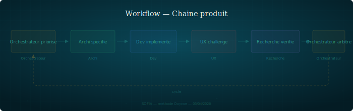

## Chaine Produit

Chaine complete de production : chaque etape a un gardien, aucun raccourci.

---

### Quand l'utiliser

Pour toute feature ou evolution qui traverse plusieurs domaines — de la priorisation a la livraison. C'est le workflow de reference quand plusieurs personas interviennent.

### Etapes

1. **PO priorise** — l'item entre dans la roadmap avec contexte et owner
2. **Archi specifie** — contrats, contraintes, ADR si besoin. Gardien : coherence avec l'architecture cible et les principes (cf. `core/principes.md`)
3. **Dev implemente** — mode plan, TDD, code. Gardien : conformite a la spec
4. **UX challenge** — l'UX verifie l'experience utilisateur, l'accessibilite, la coherence visuelle. Gardien : le produit est utilisable, pas seulement fonctionnel
5. **Recherche verifie** — verification formelle, sources, rigueur. Gardien : ce qui est affirme est vrai et correctement contextualise
6. **PO arbitre** — derniere porte. Validation finale, go/no-go

### Roles impliques

| Persona | Role |
|---------|------|
| PO | Priorise (etape 1), arbitre (etape 6) |
| Architecte | Specifie, garde la coherence structurelle |
| Dev | Implemente selon la spec |
| UX | Challenge l'experience et l'accessibilite |
| Recherche | Verifie formellement les affirmations |

### Artefacts produits

- Roadmap item priorise
- Spec / contrat d'interface
- Code + tests
- Review UX (note dans `shared/review/`)
- Validation formelle si applicable
- Decision PO documentee

### Pieges

- **Sauter une etape** — chaque etape sautee genere de la dette. La dette la plus couteuse est celle qu'on ne voit pas (cf. `protocol/tracabilite.md`)
- **Paralleliser sans contrat** — dev et UX en parallele sans spec commune = deux visions divergentes a reconcilier apres coup
- **Confondre validation PO et approbation automatique** — le PO est la derniere porte, pas un tampon. Il peut renvoyer a n'importe quelle etape
