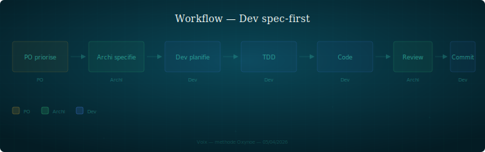

## Dev Spec-First

Workflow de développement : ne jamais coder sans cible validée.

---

### Quand l'utiliser

À chaque feature, correction ou refactoring qui touche le code produit. S'applique dès qu'un item est priorisé par l'orchestrateur.

### Étapes

1. **L'orchestrateur priorise** — l'item existe dans la roadmap avec un owner explicite
2. **Archi spécifie** — contrat d'interface, contraintes, ADR si décision structurelle (cf. `protocol/artefacts.md` pour les formats). La spec est le contrat : elle définit le quoi, pas le comment
3. **Dev planifie en mode plan** — décomposition feature par feature, chaque étape confrontée aux principes et aux ADR existants
4. **Tests d'abord (TDD)** — écrire les tests avant le code, selon la couche : moteur/opérateurs = TDD strict, CLI/IHM = tests après implémentation
5. **Code** — implémenter en respectant les responsabilités modules et les conventions du projet
6. **Review archi** — l'architecte vérifie la cohérence avec la spec et les principes. Écarts documentés, pas ignorés
7. **Commit** — le dev prépare le message, l'orchestrateur exécute

### Rôles impliqués

| Persona | Rôle |
|---------|------|
| Orchestrateur | Priorise, arbitre, commite |
| Architecte | Spécifie le contrat, review post-implémentation |
| Dev | Planifie, teste, code |

### Artefacts produits

- Spec ou contrat d'interface (dans le workspace archi)
- ADR si décision structurelle (cf. `decision-adr.md`)
- Tests unitaires / intégration
- Code + commit

### Pièges

- **Coder avant la spec** — "je sais ce qu'il faut faire" mène à du refactoring évitable. La spec force à poser les contraintes avant de toucher au code
- **Confondre plan et spec** — un plan décompose des étapes, une spec définit un contrat. Le plan sans spec produit du code sans cible
- **Skipper la review archi** — la review n'est pas une formalité. Elle détecte les écarts entre spec et implémentation avant qu'ils ne se propagent
