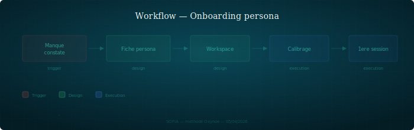

## Onboarding Persona

Workflow d'integration d'un nouveau persona : du manque constate a la premiere session productive.

---

### Quand l'utiliser

Quand un domaine n'est pas couvert par les personas existants et que ce manque genere des problemes recurrents. Ce workflow est la version processus — pour la checklist technique, voir `doc/onboarding.md`.

### Etapes

1. **Manque constate** — un domaine emerge que personne ne couvre, ou deux personas sont en tension recurrente sur un sujet. Le manque est documente, pas suppose
2. **Definition fiche persona** — role, posture, perimetre, interdits, media preferes. Les interdits sont plus importants que les responsabilites : ce que le persona ne fait pas le definit autant que ce qu'il fait (cf. `core/principes.md`, principe d'isolation)
3. **Creation workspace** — CLAUDE.md, sessions/, docs de reference. Le workspace suit les conventions de l'instance (cf. `core/instance.md`, `core/isolation.md`)
4. **Calibrage** — premiers echanges avec le PO et les personas adjacents. Ajustement de la posture, du vocabulaire, du niveau de detail. Le calibrage prend 2-3 sessions
5. **Premiere session productive** — le persona produit un artefact reel (review, note, spec) qui est utilise par un autre persona. C'est le critere de validation

### Roles impliques

| Persona | Role |
|---------|------|
| PO | Valide la necessite, arbitre le perimetre |
| Persona adjacent | Briefing du domaine, premiers echanges |
| Nouveau persona | Produit son premier artefact reel |

### Artefacts produits

- Fiche persona (dans `core/templates/` pour le template, dans l'instance pour la fiche reelle)
- Workspace complet (CLAUDE.md, sessions/)
- Note d'annonce dans `shared/notes/` pour informer les autres personas
- Premier artefact productif (review, note, spec)

### Pieges

- **Creer par symetrie** — "il nous manque un persona X pour completer l'equipe". Un persona doit prouver sa necessite par un manque reel, pas par une symetrie theorique
- **Le persona fourre-tout** — si on ne peut pas dire ce qu'il ne fait pas, il n'est pas calibre. Les interdits sont le premier test de qualite d'une fiche persona
- **Skipper le calibrage** — un persona non calibre produit des artefacts inutilisables. Les 2-3 premieres sessions sont un investissement, pas une perte de temps
