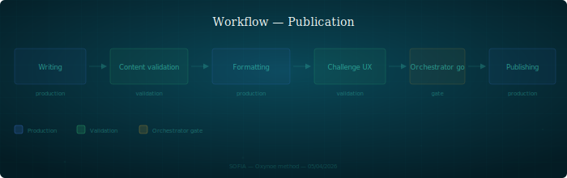

## Publication

Workflow de publication : de la rédaction à la mise en ligne.

---

### Quand l'utiliser

Pour tout contenu publié — page web, document public, livre blanc/bleu, communication externe. S'applique dès qu'un contenu sort du périmètre interne.

### Étapes

1. **Rédaction** — le rédacteur ou l'expert produit le contenu brut. Le fond prime sur la forme à ce stade
2. **Validation fond** — les experts concernés valident chacun sur leur axe (technique, stratégique, formel). Chaque axe produit une review
3. **Mise en forme** — le producteur (graphiste, intégrateur) met en forme. La structure et le style suivent les conventions du support cible
4. **Challenge UX / accessibilité** — l'UX vérifie la lisibilité, la navigation, l'accessibilité. Le contenu doit fonctionner pour le public cible
5. **Go PO** — dernière porte. Le PO vérifie l'intégrité factuelle : ce qui est publié est vrai, les sources sont correctes, le positionnement est juste
6. **Mise en ligne** — déploiement effectif. Le PO exécute ou autorise

### Rôles impliqués

| Persona | Rôle |
|---------|------|
| Rédacteur / Expert | Produit le contenu |
| Experts (archi, recherche, stratégie) | Valident sur leur axe |
| Graphiste / Producteur | Mise en forme |
| UX | Challenge accessibilité et lisibilité |
| PO | Dernière porte — intégrité factuelle, go/no-go |

### Artefacts produits

- Brouillon (dans le workspace du rédacteur)
- Reviews par axe (dans `shared/review/`)
- Contenu mis en forme (dans le support cible)
- Validation PO (implicite : le go est le commit/déploiement)

### Pièges

- **Publier sans validation fond** — la mise en forme donne une illusion de qualité. Un document bien présenté mais factuellement faux est pire qu'un brouillon correct
- **Le PO valide la forme, pas le fond** — le rôle du PO en dernière porte est spécifiquement l'intégrité factuelle. La forme a été validée avant
- **Sources non vérifiées** — une référence citée sans avoir été lue en entier propage des erreurs dans tout ce qui la cite ensuite (cf. `recherche.md`)
