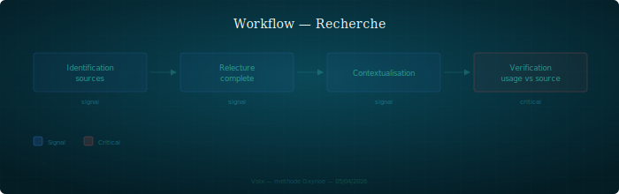

## Recherche

Workflow de recherche : de l'identification des sources à la vérification de leur usage.

---

### Quand l'utiliser

À chaque fois qu'un document cite une source externe — article, paper, documentation, spécification. S'applique aussi quand un persona affirme un fait qui nécessite une référence.

### Étapes

1. **Identification des sources** — repérer les sources pertinentes pour le sujet. Privilégier les sources primaires (paper original, spec officielle) aux sources secondaires (articles de blog, tutoriels)
2. **Relecture complète de la source** — lire la source en entier, pas seulement l'abstract ou la section citée. Une source partiellement lue est une source mal comprise
3. **Contextualisation** — formuler explicitement pourquoi cette source est pertinente pour ce sujet. Quel est le lien entre ce que la source dit et ce qu'on veut montrer
4. **Vérification contexte d'usage** — la question critique : la source dit-elle vraiment ce qu'on lui fait dire ? Vérifier que le contexte original de la source correspond à l'usage qu'on en fait

### Rôles impliqués

| Persona | Rôle |
|---------|------|
| Recherche | Exécute le workflow, produit les vérifications |
| Expert du domaine (archi, dev, stratégie) | Fournit le contexte d'usage — pourquoi cette source est citée |
| PO | Arbitre en cas de désaccord sur la pertinence |

### Artefacts produits

- Review de sources (dans `shared/review/`, format `review-sources-{sujet}-{auteur}.md`)
- Notes de contextualisation si nécessaire
- Corrections dans les documents citants si une source est mal utilisée

### Pièges

- **Contamination factuelle** — une référence mal contextualisée propage une erreur dans tous les documents qui la citent. C'est l'erreur la plus coûteuse : elle est invisible et se multiplie
- **Citer sans lire** — citer une source sur la base de son titre ou de son abstract. Le contenu réel peut contredire l'usage qu'on en fait
- **Confondre autorité et pertinence** — une source peut être fiable (auteur reconnu, journal sérieux) sans être pertinente pour le contexte d'usage. La qualité de la review dépend de la question posée, pas seulement de la source (cf. `protocol/artefacts.md`)
