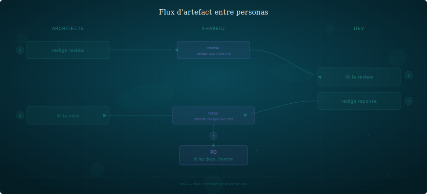

# Artefacts comme protocole

> Les personas communiquent par fichiers, pas par chat.

---

## Le principe

Dans SOFIA, les personas ne "parlent" pas entre eux. Ils déposent
des **artefacts** — des fichiers structurés, versionnés, dans des
emplacements convenus.

C'est plus lent qu'une conversation. C'est le but.

## Pourquoi des fichiers ?

### L'écriture force la clarté

Un architecte qui dépose une review a pris le temps de structurer
sa pensée. Un dev qui dépose un signalement de friction a formulé
le problème clairement. Un stratège qui dépose 3 questions a choisi
les 3 qui comptent.

Le chat encourage le flux de conscience. Le fichier encourage la
synthèse.

### Les fichiers persistent

Une conversation se ferme, un contexte se compresse. Un fichier
reste. Il est versionné par git. Il peut être relu dans 6 mois.

### Les fichiers sont adressables

"Voir la review de Mira sur l'ADR-057" est une référence précise.
"Ce qu'on a dit en session mardi" ne l'est pas.

## Types d'artefacts

| Type | Convention de nommage | Emplacement |
|------|----------------------|-------------|
| Review | `review-{sujet}-{auteur}.md` | `shared/review/` |
| Note | `note-{destinataire}-{sujet}-{auteur}.md` | `shared/notes/` |
| Résumé de session | `{YYYY-MM-DD}-{HHmm}-{persona}.md` | `{workspace}/sessions/` |
| ADR | `adr-{NNN}.md` | Selon le projet |
| Spec | `spec-{composant}.md` | `{workspace}/doc/` |

## Flux type



## Conventions

- Un artefact = un sujet. Pas de fichier fourre-tout.
- Le nom du fichier dit qui l'a écrit et pour qui/quoi.
- Les artefacts sont courts. Si ça dépasse 2 pages, c'est un doc, pas une note.
- Les artefacts ne sont jamais modifiés après dépôt — on en crée un nouveau (v2) si nécessaire.

## Bus d'échange structuré — `shared/`

Le dossier `shared/` est le bus de messages de l'équipe. Trois types
d'artefacts, chacun avec son emplacement et sa convention :

| Type | Emplacement | Convention | Usage |
|------|-------------|------------|-------|
| **Notes** | `shared/notes/` | `note-{destinataire}-{sujet}-{auteur}.md` | Messages inter-personas, signaux, questions |
| **Reviews** | `shared/review/` | `review-{sujet}-{auteur}.md` | Analyses critiques, retours structurés |
| **Features** | `shared/features/` | `feature-{sujet}.md` | Specs de nouvelles fonctionnalités |

### Roadmaps produit

`shared/` héberge les roadmaps produit — la source unique de planification.
Chaque roadmap a un **owner** qui vérifie la cohérence des items :

```
shared/
├── roadmap-{produit}.md          ← roadmaps produit (une par périmètre)
├── backlog-archive.md            ← historique des items terminés
├── notes/                        ← messages inter-personas
├── review/                       ← analyses critiques
└── features/                     ← specs fonctionnalités
```

**Il n'y a pas de backlog par persona.** Tous les items vivent dans les
roadmaps. Les personas poussent des items, l'owner vérifie. Les items
terminés migrent vers `backlog-archive.md`.

L'owner ne priorise pas — il signale et range. C'est une responsabilité
passive (pas de scan systématique à chaque session).

### Frontmatter

Chaque artefact dans `shared/` porte un frontmatter normalisé :

```yaml
---
de: mira
pour: lea
type: signal           # signal | question | demande | reponse
statut: nouveau        # nouveau | lu | traite
date: 2026-03-30
---
```

Le statut permet de savoir si un artefact a été traité. Le persona
destinataire met à jour le statut quand il le lit (`lu`) ou le traite
(`traite`). Les artefacts sans frontmatter sont traités comme `statut: traite`
(grandfather clause pour l'existant).

### Archivage

Quand un artefact passe `traite`, le déplacer dans `archives/` du dossier
parent (`notes/archives/`, `review/archives/`). Cela allège le scan
d'ouverture de session — seuls les fichiers actifs restent à la racine.

```
shared/notes/
├── note-mira-xyz-axel.md          ← actif (statut: nouveau)
└── archives/
    └── note-mira-abc-axel.md      ← traite
```

### Organisation équipe — `shared/orga/`

Les fichiers d'organisation (personas, figures, lexique) vivent dans
`shared/orga/` — séparés du bus de messages :

```
shared/orga/
├── personas/          ← fiches personas
├── figures/           ← schémas d'organisation
├── team-orga.md       ← matrice RACI, flux
└── lexique.md         ← termes du projet
```

### Features multi-produits

Les features dans `shared/features/` portent un champ `produit:` dans
leur frontmatter pour identifier le produit concerné :

```yaml
---
de: po
produit: regards
type: feature
statut: nouveau
date: 2026-03-17
---
```

### Protocole de circulation

1. L'auteur dépose l'artefact dans `shared/{type}/`
2. Le destinataire le découvre à l'ouverture de session (scan `shared/`)
3. Le destinataire met à jour le statut dans le frontmatter
4. Quand l'artefact est `traite`, le déplacer dans `archives/`
5. Le PO peut lire `shared/` pour voir l'état des échanges
