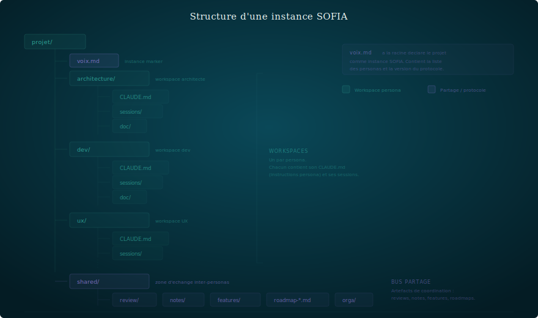

# Isolation par workspace

> Un persona = un workspace = un périmètre = un CLAUDE.md.

---

## Le principe

Chaque persona vit dans son propre espace de travail. Il a ses
fichiers, ses instructions, ses conventions, et ses limites.
Il ne peut pas lire ou écrire partout.

L'isolation n'est pas une contrainte technique — c'est ce qui
**force** le persona à rester dans son rôle.

## Pourquoi isoler ?

### Empêcher la dérive de scope

Un persona sans frontières finit par tout faire. L'architecte qui
a accès au code finit par coder. Le stratège qui peut lire les tests
finit par donner des avis techniques.

L'isolation rend la dérive impossible : le persona ne **voit** pas
ce qui est hors de son périmètre.

### Forcer les échanges formels

Si l'architecte ne peut pas modifier le code, il est obligé de
produire une spec que le dev pourra lire. Si le dev ne peut pas
modifier l'architecture, il est obligé de déposer un signalement
de friction.

L'isolation crée le besoin d'artefacts d'échange.

### Protéger le travail en cours

Un persona ne peut pas casser accidentellement le travail d'un
autre. L'UX ne va pas reformater du code. Le dev ne va pas
réécrire une review de design.

## Structure type



## La zone partagée

Les personas communiquent via un dossier partagé (`shared/`).
C'est le seul espace que tous les personas peuvent lire et écrire.

Conventions :
- **Reviews** : `review-<sujet>-<auteur>.md` — déposées dans `shared/review/`
- **Notes** : `note-<destinataire>-<sujet>-<auteur>.md` — déposées dans `shared/notes/`

Le dossier partagé est le "couloir" du bureau. On y dépose des
documents, on ne s'y installe pas.

## Le CLAUDE.md comme gardien

Le fichier `CLAUDE.md` à la racine de chaque workspace contient :

1. **Qui** — quel persona, quelle posture
2. **Quoi** — périmètre d'intervention, livrables attendus
3. **Où** — quels fichiers/dossiers sont accessibles
4. **Interdit** — ce qui est hors périmètre (lecture ET écriture)
5. **Comment** — conventions, formats, workflow

Voir `runtime/claude-code/claude-md.md` pour l'anatomie détaillée.

## Multi-instance : le cas du dev

Certains personas travaillent sur **deux repos** — leur workspace
d'analyse (dans l'instance) et un repo produit séparé. C'est le cas
typique du dev : il planifie dans `instance/dev/` et code dans `produit/`.

### Structure

```
instance/                       ← repo instance (experiments/)
├── dev/                        ← workspace dev (sessions, backlog, plans)
│   ├── CLAUDE.md
│   ├── sessions/
│   └── backlog.md
└── shared/                     ← bus d'échange

produit/                        ← repo produit (katen/)
├── CLAUDE.md                   ← instructions dev completes
├── src/
└── tests/
```

### Règles

- Le **CLAUDE.md du repo produit** est l'entrée principale du dev — c'est
  là que vivent les conventions de code, l'architecture, le processus de version.
- Le **workspace dev/ dans l'instance** contient les sessions, le backlog,
  et les plans — pas du code.
- Les commits instance = auto (`{persona}: {résumé} ({date})`).
  Les commits produit = PO exécute.
- Le dev lit `shared/notes/` et `shared/review/` au même titre que
  les autres personas — c'est dans son workflow d'ouverture.

### Pourquoi séparer ?

Le code versionné est un livrable public. Les sessions et plans sont
de l'outillage interne. Les mettre ensemble :
- Expose l'historique d'analyse dans le repo public
- Mélange les commits de code et les commits de session
- Casse l'isolation si le repo produit est ouvert par un autre outil
