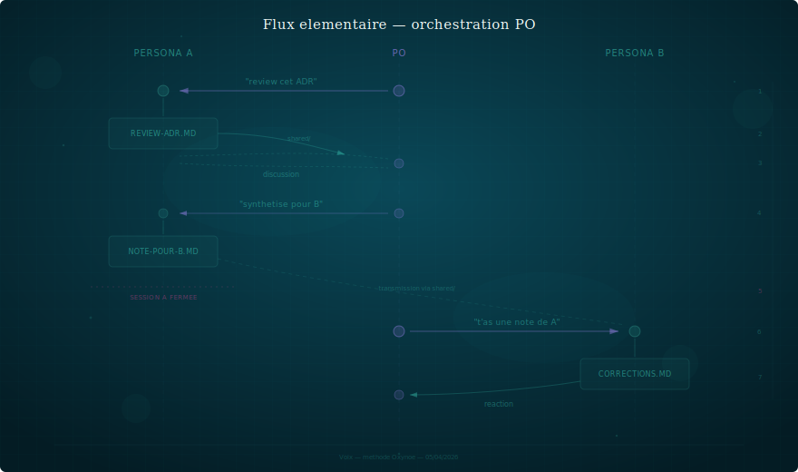
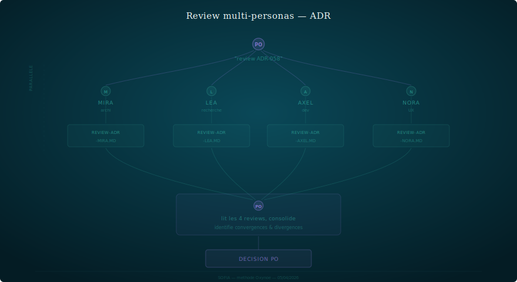
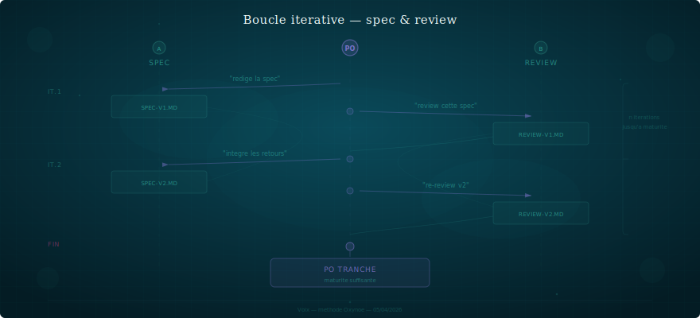

# Orchestration

> Le PO est le message bus. Rien ne circule sans lui.

---

## Le modèle mental

Dans SOFIA, les personas ne se parlent pas. Ils n'ont pas accès
aux sessions des autres. Ils ne savent même pas ce que les autres
ont dit — sauf si l'humain leur transmet.

**L'humain est l'orchestrateur.** Il ouvre une session avec un
persona, obtient un livrable, ferme la session, ouvre une session
avec un autre persona, transmet le livrable, recueille la réponse.

C'est lent. C'est voulu. Chaque transmission est un moment où
l'humain filtre, reformule, ajoute du contexte, décide ce qui
est pertinent à transmettre.

## Le flux élémentaire

Chaque flèche passe par le PO. Pas de raccourci.

## Pourquoi le PO porte le contexte

### Filtre

Le PO ne transmet pas tout. Marc produit une review de 15 points.
Le PO en retient 4 qui sont pertinents pour Mira. Les 11 autres
sont des points Marc ↔ PO qui ne concernent pas l'architecture.

### Reformule

Le PO reformule quand c'est nécessaire. Marc dit "personne ne
paiera pour ça". Le PO traduit pour Mira : "Marc challenge la
priorité de cette feature — on a besoin d'un argument d'adoption
avant de spécifier".

### Contextualise

Le PO ajoute du contexte que le persona ne peut pas avoir.
"Quand tu liras la note de Léa, sache qu'on a décidé hier avec
Marc de décaler la publication académique — ça change la priorité
de ses recommandations."

### Tranche

Le PO ne transmet pas les désaccords non résolus. Il tranche
d'abord, puis transmet la décision. Les personas appliquent,
même s'ils avaient une position différente.

## Les échanges multi-personas

### Review d'ADR par 2+ personas

C'est le cas le plus fréquent d'orchestration complexe.

Les 4 reviews sont indépendantes (parallélisables). La consolidation
est le travail du PO. La mise à jour finale revient au persona
propriétaire du document.

### Boucle itérative entre 2 personas

Parfois l'échange nécessite plusieurs allers-retours :

Le PO décide quand l'itération s'arrête. Pas les personas.

## Ce que le PO NE délègue PAS

- **La priorisation** — quel persona intervient, dans quel ordre
- **La consolidation** — synthétiser les retours de N personas
- **La décision** — trancher quand les personas divergent
- **Le timing** — quand un échange est mûr pour être transmis
- **Le filtrage** — ce qui est pertinent à transmettre ou pas

## Ce que le PO PEUT demander au persona

- "Synthétise tes points pour [autre persona]"
- "Rédige une note adressée à [autre persona]"
- "Reformule pour un public non technique"

Le persona rédige l'artefact. Le PO décide s'il le transmet,
tel quel ou modifié.

## Coût et bénéfice

### Le coût

L'orchestration prend du temps. Chaque échange PO ↔ persona
est une session. Une review d'ADR par 4 personas, c'est
4 sessions de review + 1 session de consolidation + 1-2 sessions
d'itération. Ça peut prendre une heure ou une journée.

### Le bénéfice

- Chaque persona pense dans son cadre, sans pollution
- L'humain contrôle le flux d'information
- Les décisions sont mûries, pas improvisées
- Tout est tracé (notes, reviews, sessions)
- Le résultat est meilleur que ce qu'un seul agent aurait produit

Le coût est le prix de la qualité. Si l'échange n'en vaut pas
le coût, c'est que le sujet ne nécessitait pas plusieurs personas.
